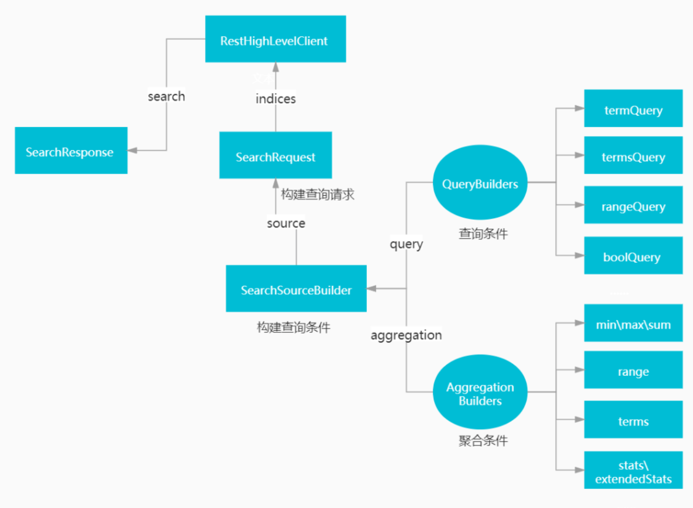
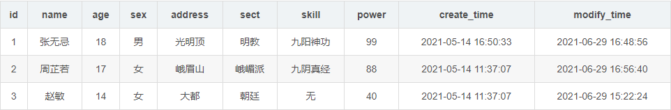

>[原文地址](https://z.itpub.net/article/detail/A7B79869961FB96969AADEA98959D9FC)

# ES的java查询
基于elasticsearch 7.13.2版本，es从7.0以后，发生了很大的更新。7.3以后，已经不推荐使用TransportClient这个client，取而代之的是Java High Level REST Client。

## ES 查询场景

- 语句查询
  - 词条查询
    - 精确查询: term (单值查询,类似 =); terms (多值查询,类似 IN)
    - 范围查询: range (类似 between...and...)
    - 模糊查询: wildcardQuery (类似LIKE)
  - 匹配查询
    - match (单个字段匹配一个值)
    - multiMatch (多字段匹配同一个值)
  - 复合查询 (bool)
    - must: 必须满足条件
    - must_not: 必须不满足条件
    - should: 应当满足条件
    - filter: 过滤，关闭评分，提高查询效率
- 聚合查询
  - 统计
    - max, min, sum, avg, count
    - stats: 一并获取max, min, sum, avg, count统计指标
    - extendedStats: 追加方差，标准差等统计指标
    - ardinality: 去重
  - 分组
    - 单字段分组
    - 多字段分组
    - 筛选后分组


## Java API相关

- SearchResponse: 查询结果
- RestHighLevelClient: 发送请求的客户端
- SearchRequest: 构建查询请求
- SearchSourceBuilder: 构建查询条件
- QueryBuilders: 查询条件
  - termQuery
  - termsQuery
  - rangeQuery
  - boolQuery
- AggregationBuilders: 聚合条件
  - min\max\sum
  - range
  - terms
  - stats\extendStats



## 测试数据

mysql:


Mysql中的一行数据在ES中以一个文档形式存在：

```json
{
  "_index" : "person",
  "_type" : "_doc",
  "_id" : "4",
  "_score" : 1.0,
  "_source" : {
    "address" : "峨眉山",
    "modifyTime" : "2021-06-29 19:46:25",
    "createTime" : "2021-05-14 11:37:07",
    "sect" : "峨嵋派",
    "sex" : "男",
    "skill" : "降龙十八掌",
    "name" : "宋青书",
    "id" : 4,
    "power" : 50,
    "age" : 21
  }
}
```

## 词条查询

所谓词条查询，也就是ES不会对查询条件进行分词处理，只有当词条和查询字符串完全匹配时，才会被查询到。

### 等值查询-term

等值查询，即筛选出一个字段等于特定值的所有记录。

SQL：

```sql
select * from person where name = '张无忌';
```

而使用ES查询语句却很不一样（注意查询字段带上keyword）：

```json
GET /person/_search
{
 "query": {
  "term": {
   "name.keyword": {
    "value": "张无忌",
    "boost": 1.0
   }
  }
 }
}
```

ElasticSearch 5.0以后，`string`类型有重大变更，移除了`string`类型，`string`字段被拆分成两种新的数据类型: `text`用于全文搜索的，而`keyword`用于关键词搜索。

查询结果：

```java
{
  "took" : ,
  "timed_out" : false,
  "_shards" : { // 分片信息
    "total" : 1, // 总计分片数
    "successful" : 1, // 查询成功的分片数
    "skipped" : , // 跳过查询的分片数
    "failed" :   // 查询失败的分片数
  },
  "hits" : { // 命中结果
    "total" : {
      "value" : 1, // 数量
      "relation" : "eq"  // 关系：等于
    },
    "max_score" : 2.8526313,  // 高分数
    "hits" : [
      {
        "_index" : "person", // 索引
        "_type" : "_doc", // 类型
        "_id" : "1",
        "_score" : 2.8526313,
        "_source" : {
          "address" : "光明顶",
          "modifyTime" : "2021-06-29 16:48:56",
          "createTime" : "2021-05-14 16:50:33",
          "sect" : "明教",
          "sex" : "男",
          "skill" : "九阳神功",
          "name" : "张无忌",
          "id" : 1,
          "power" : 99,
          "age" : 18
        }
      }
    ]
  }
}
```

Java中构造ES请求的方式：（后续例子中只保留SearchSourceBuilder的构建语句）

```java
/**
 * term查询
 *
 * @throws IOException
 */

@Autowired
private RestHighLevelClient client;

@Test
public void queryTerm() throws IOException {
 // 根据索引创建查询请求
    SearchRequest searchRequest = new SearchRequest("person");
    SearchSourceBuilder searchSourceBuilder = new SearchSourceBuilder();
    // 构建查询语句
    searchSourceBuilder.query(QueryBuilders.termQuery("name.keyword", "张无忌"));
    System.out.println("searchSourceBuilder=====================" + searchSourceBuilder);
    searchRequest.source(searchSourceBuilder);
    SearchResponse response = client.search(searchRequest, RequestOptions.DEFAULT);
    System.out.println(JSONObject.toJSON(response));
}
```

仔细观察查询结果，会发现ES查询结果中会带有`_score`这一项，ES会根据结果匹配程度进行评分。打分是会耗费性能的，如果确认自己的查询不需要评分，就设置查询语句关闭评分：

```json
GET /person/_search
{
 "query": {
  "constant_score": {
   "filter": {
    "term": {
     "sect.keyword": {
      "value": "张无忌",
      "boost": 1.0
     }
    }
   },
   "boost": 1.0
  }
 }
}
```

Java构建查询语句：

```java
SearchSourceBuilder searchSourceBuilder = new SearchSourceBuilder();
// 这样构造的查询条件，将不进行score计算，从而提高查询效率
searchSourceBuilder.query(QueryBuilders.constantScoreQuery(QueryBuilders.termQuery("sect.keyword", "明教")));
```

### 多值查询-terms

多条件查询类似Mysql里的`IN`查询，例如：

```sql
select * from persons where sect in('明教','武当派');
```

ES查询语句：

```json
GET /person/_search
{
 "query": {
  "terms": {
   "sect.keyword": [
    "明教",
    "武当派"
   ],
   "boost": 1.0
  }
 }
}
```

Java实现：

```java
SearchSourceBuilder searchSourceBuilder = new SearchSourceBuilder();
// 构建查询语句
searchSourceBuilder.query(QueryBuilders.termsQuery("sect.keyword", Arrays.asList("明教", "武当派")));
}
```

### 范围查询-range

范围查询，即查询某字段在特定区间的记录。

SQL:

```sql
select * from pesons where age between 18 and 22;
```

ES查询语句：

```json
GET /person/_search
{
 "query": {
  "range": {
   "age": {
    "from": 10,
    "to": 20,
    "include_lower": true,
    "include_upper": true,
    "boost": 1.0
   }
  }
 }
}
```

Java构建查询条件：

```java
SearchSourceBuilder searchSourceBuilder = new SearchSourceBuilder();
// 构建查询语句
searchSourceBuilder.query(QueryBuilders.rangeQuery("age").gte(10).lte(30));
}
```

### 前缀查询-prefix

前缀查询类似于SQL中的模糊查询。

SQL：

```sql
select * from persons where sect like '武当%';
```

ES查询语句：

```json
{
 "query": {
  "prefix": {
   "sect.keyword": {
    "value": "武当",
    "boost": 1.0
   }
  }
 }
}
```

Java构建查询条件：

```java
SearchSourceBuilder searchSourceBuilder = new SearchSourceBuilder();
// 构建查询语句
searchSourceBuilder.query(QueryBuilders.prefixQuery("sect.keyword","武当"));
```

### 通配符查询-wildcard

通配符查询，与前缀查询类似，都属于模糊查询的范畴，但通配符显然功能更强。

SQL：

```sql
select * from persons where name like '张%忌';
```

ES查询语句：

```json
{
 "query": {
  "wildcard": {
   "sect.keyword": {
    "wildcard": "张*忌",
    "boost": 1.0
   }
  }
 }
}
```

Java构建查询条件：

```java
SearchSourceBuilder searchSourceBuilder = new SearchSourceBuilder();
// 构建查询语句
searchSourceBuilder.query(QueryBuilders.wildcardQuery("sect.keyword","张*忌"));
```

## 复合查询

前面的例子都是单个条件查询，在实际应用中，我们很有可能会过滤多个值或字段。先看一个简单的例子：

```sql
select * from persons where sex = '女' and sect = '明教';

```

这样的多条件等值查询，就要借用到组合过滤器了，其查询语句是：

```json
{
 "query": {
  "bool": {
   "must": [
    {
     "term": {
      "sex": {
       "value": "女",
       "boost": 1.0
      }
     }
    },
    {
     "term": {
      "sect.keywords": {
       "value": "明教",
       "boost": 1.0
      }
     }
    }
   ],
   "adjust_pure_negative": true,
   "boost": 1.0
  }
 }
}
```

Java构造查询语句：

```java
SearchSourceBuilder searchSourceBuilder = new SearchSourceBuilder();
// 构建查询语句
searchSourceBuilder.query(QueryBuilders.boolQuery()
        .must(QueryBuilders.termQuery("sex", "女"))
        .must(QueryBuilders.termQuery("sect.keyword", "明教"))
);
```

### 布尔查询

布尔过滤器（bool filter）属于复合过滤器（compound filter）的一种 ，可以接受多个其他过滤器作为参数，并将这些过滤器结合成各式各样的布尔（逻辑）组合。

bool 过滤器下可以有4种子条件，可以任选其中任意一个或多个。filter是比较特殊的，这里先不说。

```json
{
   "bool" : {
      "must" :     [],
      "should" :   [],
      "must_not" : [],
   }
}
```

- must：所有的语句都必须匹配，与 ‘=’ 等价。
- must_not：所有的语句都不能匹配，与 ‘!=’ 或 not in 等价。
- should：至少有n个语句要匹配，n由参数控制。

**精度控制**：

所有 `must` 语句必须匹配，所有 `must_not` 语句都必须不匹配，但有多少 `should` 语句应该匹配呢？默认情况下，没有 `should` 语句是必须匹配的，只有一个例外：那就是当没有 `must` 语句的时候，至少有一个 `should` 语句必须匹配。

我们可以通过 `minimum_should_match` 参数控制需要匹配的 `should` 语句的数量，它既可以是一个的数字，又可以是个百分比：

```json
GET /person/_search
{
 "query": {
  "bool": {
   "must": [
    {
     "term": {
      "sex": {
       "value": "女",
       "boost": 1.0
      }
     }
    }
   ],
   "should": [
    {
     "term": {
      "address.keyword": {
       "value": "峨眉山",
       "boost": 1.0
      }
     }
    },
    {
     "term": {
      "sect.keyword": {
       "value": "明教",
       "boost": 1.0
      }
     }
    }
   ],
   "adjust_pure_negative": true,
   "minimum_should_match": "1",
   "boost": 1.0
  }
 }
}
```

Java构建查询语句：

```java
SearchSourceBuilder searchSourceBuilder = new SearchSourceBuilder();
// 构建查询语句
searchSourceBuilder.query(QueryBuilders.boolQuery()
        .must(QueryBuilders.termQuery("sex", "女"))
        .should(QueryBuilders.termQuery("address.word", "峨眉山"))
        .should(QueryBuilders.termQuery("sect.keyword", "明教"))
        .minimumShouldMatch(1)
);
```

然后，看一个复杂些的例子，将bool的各子句联合使用：

```sql
select 
 *
from
 persons
where 
 sex = '女'
and
 age between 30 and 40
and 
 sect != '明教'
and 
 (address = '峨眉山' OR skill = '暗器')
```

用 Elasticsearch 来表示上面的 SQL 例子：

```json
GET /person/_search
{
 "query": {
  "bool": {
   "must": [
    {
     "term": {
      "sex": {
       "value": "女",
       "boost": 1.0
      }
     }
    },
    {
     "range": {
      "age": {
       "from": 30,
       "to": 40,
       "include_lower": true,
       "include_upper": true,
       "boost": 1.0
      }
     }
    }
   ],
   "must_not": [
    {
     "term": {
      "sect.keyword": {
       "value": "明教",
       "boost": 1.0
      }
     }
    }
   ],
   "should": [
    {
     "term": {
      "address.keyword": {
       "value": "峨眉山",
       "boost": 1.0
      }
     }
    },
    {
     "term": {
      "skill.keyword": {
       "value": "暗器",
       "boost": 1.0
      }
     }
    }
   ],
   "adjust_pure_negative": true,
   "minimum_should_match": "1",
   "boost": 1.0
  }
 }
}
```

用Java构建这个查询条件：

```java
SearchSourceBuilder searchSourceBuilder = new SearchSourceBuilder();
// 构建查询语句
BoolQueryBuilder boolQueryBuilder = QueryBuilders.boolQuery()
        .must(QueryBuilders.termQuery("sex", "女"))
        .must(QueryBuilders.rangeQuery("age").gte(30).lte(40))
        .mustNot(QueryBuilders.termQuery("sect.keyword", "明教"))
        .should(QueryBuilders.termQuery("address.keyword", "峨眉山"))
        .should(QueryBuilders.rangeQuery("power.keyword").gte(50).lte(80))
        .minimumShouldMatch(1);  // 设置should至少需要满足几个条件

// 将BoolQueryBuilder构建到SearchSourceBuilder中
searchSourceBuilder.query(boolQueryBuilder);
```

### Filter查询

`query`和`filter`的区别：`query`查询的时候，会先比较查询条件，然后计算分值，后返回文档结果；而`filter`是先判断是否满足查询条件，如果不满足会缓存查询结果（记录该文档不满足结果），满足的话，就直接缓存结果，`filter`不会对结果进行评分，能够提高查询效率。

`filter`的使用方式比较多样，下面用几个例子演示一下。

**方式一**，单独使用：

```json
{
 "query": {
  "bool": {
   "filter": [
    {
     "term": {
      "sex": {
       "value": "男",
       "boost": 1.0
      }
     }
    }
   ],
   "adjust_pure_negative": true,
   "boost": 1.0
  }
 }
}
```

单独使用时，`filter`与`must`基本一样，不同的是`filter`不计算评分，效率更高。

Java构建查询语句：

```java
SearchSourceBuilder searchSourceBuilder = new SearchSourceBuilder();
// 构建查询语句
searchSourceBuilder.query(QueryBuilders.boolQuery()
        .filter(QueryBuilders.termQuery("sex", "男"))
);
```

**方式二**，和must、must_not同级，相当于子查询：

```java
select * from (select * from persons where sect = '明教')) a where sex = '女';
```

ES查询语句：

```json
{
 "query": {
  "bool": {
   "must": [
    {
     "term": {
      "sect.keyword": {
       "value": "明教",
       "boost": 1.0
      }
     }
    }
   ],
   "filter": [
    {
     "term": {
      "sex": {
       "value": "女",
       "boost": 1.0
      }
     }
    }
   ],
   "adjust_pure_negative": true,
   "boost": 1.0
  }
 }
}
```

Java：

```java
SearchSourceBuilder searchSourceBuilder = new SearchSourceBuilder();
// 构建查询语句
searchSourceBuilder.query(QueryBuilders.boolQuery()
        .must(QueryBuilders.termQuery("sect.keyword", "明教"))
        .filter(QueryBuilders.termQuery("sex", "女"))
);
```

**方式三**，将`must`、`must_not`置于`filter`下，这种方式是常用的：

```json
{
 "query": {
  "bool": {
   "filter": [
    {
     "bool": {
      "must": [
       {
        "term": {
         "sect.keyword": {
          "value": "明教",
          "boost": 1.0
         }
        }
       },
       {
        "range": {
         "age": {
          "from": 20,
          "to": 35,
          "include_lower": true,
          "include_upper": true,
          "boost": 1.0
         }
        }
       }
      ],
      "must_not": [
       {
        "term": {
         "sex.keyword": {
          "value": "女",
          "boost": 1.0
         }
        }
       }
      ],
      "adjust_pure_negative": true,
      "boost": 1.0
     }
    }
   ],
   "adjust_pure_negative": true,
   "boost": 1.0
  }
 }
}
```

Java:

```java
SearchSourceBuilder searchSourceBuilder = new SearchSourceBuilder();
// 构建查询语句
searchSourceBuilder.query(QueryBuilders.boolQuery()
        .filter(QueryBuilders.boolQuery()
                .must(QueryBuilders.termQuery("sect.keyword", "明教"))
                .must(QueryBuilders.rangeQuery("age").gte(20).lte(35))
                .mustNot(QueryBuilders.termQuery("sex.keyword", "女")))
);
```

## 聚合查询

### 值，平均值，求和

案例：查询大年龄、小年龄、平均年龄。

SQL：

```sql
select max(age) from persons;
```

ES：

```json
GET /person/_search
{
 "aggregations": {
  "max_age": {
   "max": {
    "field": "age"
   }
  }
 }
}
```

java：

```java
@Autowired
private RestHighLevelClient client;

@Test
public void maxQueryTest() throws IOException {
 // 聚合查询条件
    AggregationBuilder aggBuilder = AggregationBuilders.max("max_age").field("age");
    SearchRequest searchRequest = new SearchRequest("person");
    SearchSourceBuilder searchSourceBuilder = new SearchSourceBuilder();
    // 将聚合查询条件构建到SearchSourceBuilder中
    searchSourceBuilder.aggregation(aggBuilder);
    System.out.println("searchSourceBuilder----->" + searchSourceBuilder);

    searchRequest.source(searchSourceBuilder);
    // 执行查询，获取SearchResponse
    SearchResponse response = client.search(searchRequest, RequestOptions.DEFAULT);
    System.out.println(JSONObject.toJSON(response));
}
```

使用聚合查询，结果中默认只会返回10条文档数据（当然我们关心的是聚合的结果，而非文档）。返回多少条数据可以自主控制：

```json
GET /person/_search
{
 "size": 20,
 "aggregations": {
  "max_age": {
   "max": {
    "field": "age"
   }
  }
 }
}
```

而Java中只需增加下面一条语句即可：

```java
searchSourceBuilder.size(20);
```

与max类似，其他统计查询也很简单：

```java
AggregationBuilder minBuilder = AggregationBuilders.min("min_age").field("age");
AggregationBuilder avgBuilder = AggregationBuilders.avg("min_age").field("age");
AggregationBuilder sumBuilder = AggregationBuilders.sum("min_age").field("age");
AggregationBuilder countBuilder = AggregationBuilders.count("min_age").field("age");
```

### 去重查询

案例：查询一共有多少个门派。

SQL：

```sql
select count(distinct sect) from persons;
```

ES：

```json
{
 "aggregations": {
  "sect_count": {
   "cardinality": {
    "field": "sect.keyword"
   }
  }
 }
}
```

Java：

```java
@Test
public void cardinalityQueryTest() throws IOException {
 // 创建某个索引的request
    SearchRequest searchRequest = new SearchRequest("person");
    // 查询条件
    SearchSourceBuilder searchSourceBuilder = new SearchSourceBuilder();
    // 聚合查询
    AggregationBuilder aggBuilder = AggregationBuilders.cardinality("sect_count").field("sect.keyword");
    searchSourceBuilder.size();
    // 将聚合查询构建到查询条件中
    searchSourceBuilder.aggregation(aggBuilder);
    System.out.println("searchSourceBuilder----->" + searchSourceBuilder);

    searchRequest.source(searchSourceBuilder);
    // 执行查询，获取结果
    SearchResponse response = client.search(searchRequest, RequestOptions.DEFAULT);
    System.out.println(JSONObject.toJSON(response));
}
```

### 分组聚合

**单条件分组**

SQL：

```sql
select sect,count(id) from mytest.persons group by sect;
```

ES：

```json
{
 "size": ,
 "aggregations": {
  "sect_count": {
   "terms": {
    "field": "sect.keyword",
    "size": 10,
    "min_doc_count": 1,
    "shard_min_doc_count": ,
    "show_term_doc_count_error": false,
    "order": [
     {
      "_count": "desc"
     },
     {
      "_key": "asc"
     }
    ]
   }
  }
 }
}
```

Java：

```java
SearchRequest searchRequest = new SearchRequest("person");
SearchSourceBuilder searchSourceBuilder = new SearchSourceBuilder();
searchSourceBuilder.size();
// 按sect分组
AggregationBuilder aggBuilder = AggregationBuilders.terms("sect_count").field("sect.keyword");
searchSourceBuilder.aggregation(aggBuilder);
```

**多条件分组**

案例：查询每个门派各有多少个男性和女性

SQL：

```sql
select sect,sex,count(id) from mytest.persons group by sect,sex;
```

ES：

```json
{
 "aggregations": {
  "sect_count": {
   "terms": {
    "field": "sect.keyword",
    "size": 10
   },
   "aggregations": {
    "sex_count": {
     "terms": {
      "field": "sex.keyword",
      "size": 10
     }
    }
   }
  }
 }
}
```

### 过滤聚合

前面所有聚合的例子请求都省略了 `query`，整个请求只不过是一个聚合。这意味着我们对全部数据进行了聚合，但现实应用中，我们常常对特定范围的数据进行聚合，例如下例。

案例：查询明教中的大年龄。这涉及到聚合与条件查询一起使用。

SQL：

```sql
select max(age) from mytest.persons where sect = '明教';
```

ES:

```json
GET /person/_search
{
 "query": {
  "term": {
   "sect.keyword": {
    "value": "明教",
    "boost": 1.0
   }
  }
 },
 "aggregations": {
  "max_age": {
   "max": {
    "field": "age"
   }
  }
 }
}
```

Java：

```java
SearchRequest searchRequest = new SearchRequest("person");
SearchSourceBuilder searchSourceBuilder = new SearchSourceBuilder();
// 聚合查询条件
AggregationBuilder maxBuilder = AggregationBuilders.max("max_age").field("age");
// 等值查询
searchSourceBuilder.query(QueryBuilders.termQuery("sect.keyword", "明教"));
searchSourceBuilder.aggregation(maxBuilder);
```

另外还有一些更复杂的查询例子。

案例：查询0-20，21-40，41-60，61以上的各有多少人。

SQL：

```sql
select 
 sum(case when age<=20 then 1 else  end) ageGroup1,
 sum(case when age >20 and age <=40 then 1 else  end) ageGroup2,
 sum(case when age >40 and age <=60 then 1 else  end) ageGroup3,
 sum(case when age >60 and age <=200 then 1 else  end) ageGroup4
from 
 mytest.persons;
```

ES：

```json
{
 "size": ,
 "aggregations": {
  "age_avg": {
   "range": {
    "field": "age",
    "ranges": [
     {
      "from": 0.0,
      "to": 20.0
     },
     {
      "from": 21.0,
      "to": 40.0
     },
     {
      "from": 41.0,
      "to": 60.0
     },
     {
      "from": 61.0,
      "to": 200.0
     }
    ],
    "keyed": false
   }
  }
 }
}
```

查询结果：

```json
"aggregations" : {
  "age_avg" : {
    "buckets" : [
      {
        "key" : "0.0-20.0",
        "from" : 0.0,
        "to" : 20.0,
        "doc_count" : 3
      },
      {
        "key" : "21.0-40.0",
        "from" : 21.0,
        "to" : 40.0,
        "doc_count" : 13
      },
      {
        "key" : "41.0-60.0",
        "from" : 41.0,
        "to" : 60.0,
        "doc_count" : 4
      },
      {
        "key" : "61.0-200.0",
        "from" : 61.0,
        "to" : 200.0,
        "doc_count" : 1
      }
    ]
  }
}
```

## 更多案例

### ElasticSearch 聚合筛选，类似SQL里面的having

我们在实际业务场景中会遇到聚合筛选的需求，需要先分组然后聚合，再通过聚合的结果进行筛选，关系型数据库中有`having`或者子查询来实现，ES中key使用 `bucket_selector` 来实现此功能

场景: 需要找出下单次数大于等于2单，并且平均下单金额大于等于100的客户

在关系型数据库中对应的SQL语句

```sql
SELECT 
	userId,
	AVG(amount) avgAmount,
	count(*) orderCount
FROM type_order
GROUP by userId
HAVING avgAmount >= 100 and orderCount >=2
```

ES 的 query：

```json
GET index_test/type_order/_search
{
  "size": 0,
  "aggs": {
    "groupUserId": {
      "terms": {
        "field": "userId"
      },
      "aggs": {
        "avgAmount": {
          "avg": {
            "field": "amount"
          }
        },
        "having": {
          "bucket_selector": {
            "buckets_path": {
              "orderCount": "_count",
              "avgAmount": "avgAmount"
            },
            "script": {
              "source": "params.avgAmount >= 100 && params.orderCount >=2 "
            }
          }
        }
      }
    }
  }
}
```

返回结果

```json
{
  "took": 16,
  "timed_out": false,
  "_shards": {
    "total": 5,
    "successful": 5,
    "skipped": 0,
    "failed": 0
  },
  "hits": {
    "total": 4,
    "max_score": 0,
    "hits": []
  },
  "aggregations": {
    "groupUserId": {
      "doc_count_error_upper_bound": 0,
      "sum_other_doc_count": 0,
      "buckets": [
        {
          "key": 1000,
          "doc_count": 2,
          "avgAmount": {
            "value": 275
          }
        }
      ]
    }
  }
}
```

在Java Api 中的实现方式

```java
String tremsAlias = "userIdGroup";

//先分组，如果不指定size，默认10条，这里可以传个int最大值 2147483647，一次取所有数据
TermsAggregationBuilder termsAgg = AggregationBuilders.terms(tremsAlias).field("userId").size(Integer.MAX_VALUE).order(Terms.Order.term(true));
//聚合，count为自带的
termsAgg.subAggregation(AggregationBuilders.avg("avgAmount").field("amount"));
//声明BucketPath，用于后面的bucket筛选
Map<String, String> bucketsPathsMap = new HashMap<>(8);
bucketsPathsMap.put("orderCount", "_count");
bucketsPathsMap.put("avgAmount", "avgAmount");
//设置脚本
Script script = new Script("params.avgAmount >= 100 && params.orderCount >=2");

//构建bucket选择器
BucketSelectorPipelineAggregationBuilder bs =
        PipelineAggregatorBuilders.bucketSelector("having", bucketsPathsMap, script);

termsAgg.subAggregation(bs);

SearchRequestBuilder sb = client.prepareSearch("index_test").setTypes("type_order");
SearchResponse sr = sb.setSize(0).addAggregation(termsAgg).execute().actionGet();
System.out.println("查询Query：");
System.out.println(sb);

//获取聚合筛选的结果数据
LongTerms lt = sr.getAggregations().get(tremsAlias);
List<LongTerms.Bucket> buckets = lt.getBuckets();
for (int i = 0; i < buckets.size(); i++) {
    LongTerms.Bucket bucket = buckets.get(i);
    System.out.println("-------------------------");
    System.out.println(bucket.getKey());
    System.out.println("count = " + bucket.getDocCount());
    List<Aggregation> list = bucket.getAggregations().asList();
    for (Aggregation agg : list) {
        if (agg instanceof InternalAvg) {
            InternalAvg ia = bucket.getAggregations().get("avgAmount");
            System.out.println("avgAmount = " + ia.getValue());
        }
    }
    System.out.println("-------------------------");

}
```