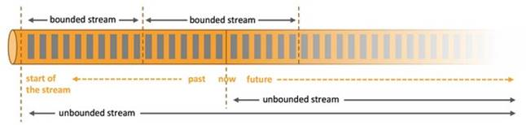

# 简介
Flink - Apache Flink 是为分布式、高性能、随时可用以及准确的流处理应用程序打造的开源流处理框架

# 重要特点

## 事件驱动型(Event-driven)
事件驱动型应用是一类具有状态的应用，它从一个或多个事件流提取数据，并根据到来的事件触发计算、状态更新或其他外部动作。比较典型的就是以 kafka 为代表的消息队列几乎都是事件驱动型应用。

## 流与批的世界观
**批处理**的特点是有界、持久、大量，非常适合需要访问全套记录才能完成的计算工作，一般用于离线统计。

**流处理**的特点是无界、实时, 无需针对整个数据集执行操作，而是对通过系统传输的每个数据项执行操作，一般用于实时统计。

在 spark 的世界观中，一切都是由批次组成的，离线数据是一个大批次，而实时数据是由一个一个无限的小批次组成的。

而在 flink 的世界观中，一切都是由流组成的，离线数据是有界限的流，实时数据是一个没有界限的流，这就是所谓的有界流和无界流。

**无界数据流**：无界数据流有一个开始但是没有结束，它们不会在生成时终止并提供数据，必须连续处理无界流，也就是说必须在获取后立即处理 event。对于无界数据流我们无法等待所有数据都到达，因为输入是无界的，并且在任何时间点都不会完成。处理无界数据通常要求以特定顺序（例如事件发生的顺序）获取 event，以便能够推断结果完整性。

**有界数据流**：有界数据流有明确定义的开始和结束，可以在执行任何计算之前通过获取所有数据来处理有界流，处理有界流不需要有序获取，因为可以始终对有界数据集进行排序，有界流的处理也称为批处理。



这种以流为世界观的架构，获得的最大好处就是具有极低的延迟。

# 应用场景

## 事件驱动型应用

事件驱动型应用是一类具有状态的应用，它从一个或多个事件流提取数据，并根据到来的事件触发计算、状态更新或其他外部动作。

事件驱动型应用是在计算存储分离的传统应用基础上进化而来。在传统架构中，应用需要读写远程事务型数据库。

相反，事件驱动型应用是基于状态化流处理来完成。在该设计中，数据和计算不会分离，应用只需访问本地（内存或磁盘）即可获取数据。系统容错性的实现依赖于定期向远程持久化存储写入 checkpoint。下图描述了传统应用和事件驱动型应用架构的区别。


### 优势

事件驱动型应用无须查询远程数据库，本地数据访问使得它具有更高的吞吐和更低的延迟。而由于定期向远程持久化存储的 checkpoint 工作可以异步、增量式完成，因此对于正常事件处理的影响甚微。

事件驱动型应用的优势不仅限于本地数据访问。传统分层架构下，通常多个应用会共享同一个数据库，因而任何对数据库自身的更改（例如：由应用更新或服务扩容导致数据布局发生改变）都需要谨慎协调。反观事件驱动型应用，由于只需考虑自身数据，因此在更改数据表示或服务扩容时所需的协调工作将大大减少。

### Flink 如何支持事件驱动型应用

事件驱动型应用会受制于底层流处理系统对时间和状态的把控能力，Flink 诸多优秀特质都是围绕这些方面来设计的。

Flink 提供了一系列丰富的状态操作原语，允许以精确一次的一致性语义合并海量规模（TB 级别）的状态数据。此外，Flink 还支持事件时间和自由度极高的定制化窗口逻辑，而且它内置的 ProcessFunction 支持细粒度时间控制，方便实现一些高级业务逻辑。同时，Flink 还拥有一个复杂事件处理（CEP）类库，可以用来检测数据流中的模式。

Flink 中针对事件驱动应用的明星特性当属 savepoint。Savepoint 是一个一致性的状态映像，它可以用来初始化任意状态兼容的应用。在完成一次 savepoint 后，即可放心对应用升级或扩容，还可以启动多个版本的应用来完成 A/B 测试。

## 数据分析应用

数据分析任务需要从原始数据中提取有价值的信息和指标。传统的分析方式通常是利用批查询，或将事件记录下来并基于此有限数据集构建应用来完成。为了得到最新数据的分析结果，必须先将它们加入分析数据集并重新执行查询或运行应用，随后将结果写入存储系统或生成报告。

借助一些先进的流处理引擎，还可以实时地进行数据分析。和传统模式下读取有限数据集不同，流式查询或应用会接入实时事件流，并随着事件消费持续产生和更新结果。这些结果数据可能会写入外部数据库系统或以内部状态的形式维护。仪表展示应用可以相应地从外部数据库读取数据或直接查询应用的内部状态。

如下图所示，Apache Flink 同时支持流式及批量分析应用。


### 流式分析应用的优势

和批量分析相比，由于流式分析省掉了周期性的数据导入和查询过程，因此从事件中获取指标的延迟更低。不仅如此，批量查询必须处理那些由定期导入和输入有界性导致的人工数据边界，而流式查询则无须考虑该问题。

另一方面，流式分析会简化应用抽象。批量查询的流水线通常由多个独立部件组成，需要周期性地调度提取数据和执行查询。如此复杂的流水线操作起来并不容易，一旦某个组件出错将会影响流水线的后续步骤。而流式分析应用整体运行在 Flink 之类的高端流处理系统之上，涵盖了从数据接入到连续结果计算的所有步骤，因此可以依赖底层引擎提供的故障恢复机制。

### Flink 如何支持数据分析类应用

Flink 为持续流式分析和批量分析都提供了良好的支持。具体而言，它内置了一个符合 ANSI 标准的 SQL 接口，将批、流查询的语义统一起来。无论是在记录事件的静态数据集上还是实时事件流上，相同 SQL 查询都会得到一致的结果。同时 Flink 还支持丰富的用户自定义函数，允许在 SQL 中执行定制化代码。如果还需进一步定制逻辑，可以利用 Flink DataStream API 和 DataSet API 进行更低层次的控制。此外，Flink 的 Gelly 库为基于批量数据集的大规模高性能图分析提供了算法和构建模块支持。

## 数据管道应用

提取-转换-加载（ETL）是一种在存储系统之间进行数据转换和迁移的常用方法。ETL 作业通常会周期性地触发，将数据从事务型数据库拷贝到分析型数据库或数据仓库。

数据管道和 ETL 作业的用途相似，都可以转换、丰富数据，并将其从某个存储系统移动到另一个。但数据管道是以持续流模式运行，而非周期性触发。因此它支持从一个不断生成数据的源头读取记录，并将它们以低延迟移动到终点。例如：数据管道可以用来监控文件系统目录中的新文件，并将其数据写入事件日志；另一个应用可能会将事件流物化到数据库或增量构建和优化查询索引。

下图描述了周期性 ETL 作业和持续数据管道的差异。


### 数据管道的优势

和周期性 ETL 作业相比，持续数据管道可以明显降低将数据移动到目的端的延迟。此外，由于它能够持续消费和发送数据，因此用途更广，支持用例更多。

### Flink 如何支持数据管道应用

很多常见的数据转换和增强操作可以利用 Flink 的 SQL 接口（或 Table API）及用户自定义函数解决。如果数据管道有更高级的需求，可以选择更通用的 DataStream API 来实现。Flink 为多种数据存储系统（如：Kafka、Kinesis、Elasticsearch、JDBC数据库系统等）内置了连接器。同时它还提供了文件系统的连续型数据源及数据汇，可用来监控目录变化和以时间分区的方式写入文件。


# 数据集类型
- 无穷数据集：无穷的持续集成的数据集合
- 有界数据集：有限不会改变的数据集合

常见的无穷数据集

- 用户与客户端的实时交互数据
- 应用实时产生的日志
- 金融市场的实时交易记录
- ...

数据运算模型：

- 流式：只要数据一直在产生，计算就持续地进行
- 批处理：在预先定义的时间内运行计算，当完成时释放计算机资源

# Flink基石
- Checkpoint
  - 基于Chandy-Lamport算法，实现了分布式一致性怪招，提供了一致性语义
- State
  - 丰富的State API，ValueState，ListState，MapState，BroadcastState
- Time
  - 实现了Watermark机制。乱序数据处理，迟到数据容忍
- Window
  - 开箱即用的滚动，滑动会话窗口。以及灵活的自定义窗口

从下至上，Flink 整体结构


1. 部署：Flink 支持本地运行、能在独立集群或者在被 YARN 或 Mesos 管理的集群上运行， 也能部署在云上。

2. 运行：Flink 的核心是分布式流式数据引擎，意味着数据以一次一个事件的形式被处理。

3. API：DataStream、DataSet、Table、SQL API。

4. 扩展库：Flink 还包括用于复杂事件处理，机器学习，图形处理和 Apache Storm 兼容性的专用代码库。

# Flink 数据流编程模型

## 抽象级别

Flink 提供了不同的抽象级别以开发流式或批处理应用。


- 最底层提供了有状态流。它将通过 过程函数（Process Function）嵌入到 DataStream API 中。它允许用户可以自由地处理来自一个或多个流数据的事件，并使用一致、容错的状态。除此之外，用户可以注册事件时间和处理事件回调，从而使程序可以实现复杂的计算。
- DataStream / DataSet API 是 Flink 提供的核心 API ，DataSet 处理有界的数据集，DataStream 处理有界或者无界的数据流。用户可以通过各种方法（map / flatmap / window / keyby / sum / max / min / avg / join 等）将数据进行转换 / 计算。
- **Table API** 是以 表 为中心的声明式 DSL，其中表可能会动态变化（在表达流数据时）。Table API 提供了例如 select、project、join、group-by、aggregate 等操作，使用起来却更加简洁（代码量更少）。

可以在表与 DataStream/DataSet 之间无缝切换，也允许程序将 Table API 与 DataStream 以及 DataSet 混合使用。

- Flink 提供的最高层级的抽象是 **SQL** 。这一层抽象在语法与表达能力上与 Table API 类似，但是是以 SQL查询表达式的形式表现程序。SQL 抽象与 Table API 交互密切，同时 SQL 查询可以直接在 Table API 定义的表上执行。

## Flink 程序与数据流结构


1. Source: 数据源，Flink 在流处理和批处理上的 source 大概有 4 类：基于`本地集合`的 source、基于`文件`的 source、基于`网络套接字`的 source、`自定义`的 source。自定义的 source 常见的有 `Apache kafka`、`Amazon Kinesis Streams`、`RabbitMQ`、`Twitter Streaming API`、`Apache NiFi` 等，当然你也可以定义自己的 source。

2. Transformation：数据转换的各种操作，有 `Map / FlatMap / Filter / KeyBy / Reduce / Fold / Aggregations / Window / WindowAll / Union / Window join / Split / Select / Project` 等，操作很多，可以将数据转换计算成你想要的数据。

3. Sink：接收器，Flink 将转换计算后的数据发送的地点 ，你可能需要存储下来，Flink 常见的 Sink 大概有如下几类：`写入文件`、`打印出来`、`写入 socket` 、`自定义的 sink` 。自定义的 sink 常见的有 `Apache kafka`、`RabbitMQ`、`MySQL`、`ElasticSearch`、`Apache Cassandra`、`Hadoop FileSystem` 等，同理你也可以定义自己的 sink。


- Program Code：编写的 Flink 应用程序代码
- Job Client：Job Client 不是 Flink 程序执行的内部部分，但它是任务执行的起点。 Job Client 负责接受用户的程序代码，然后创建数据流，将数据流提交给 Job Manager 以便进一步执行。 执行完成后，Job Client 将结果返回给用户


- Job Manager：主进程（也称为作业管理器）协调和管理程序的执行。 它的主要职责包括安排任务，管理checkpoint ，故障恢复等。机器集群中至少要有一个 master，master 负责调度 task，协调 checkpoints 和容灾，高可用设置的话可以有多个 master，但要保证一个是 leader, 其他是 standby; Job Manager 包含 Actor system、Scheduler、Check pointing 三个重要的组件

- Task Manager：从 Job Manager 处接收需要部署的 Task。Task Manager 是在 JVM 中的一个或多个线程中执行任务的工作节点。 任务执行的并行性由每个 Task Manager 上可用的任务槽决定。 每个任务代表分配给任务槽的一组资源。 例如，如果 Task Manager 有四个插槽，那么它将为每个插槽分配 25％ 的内存。 可以在任务槽中运行一个或多个线程。 同一插槽中的线程共享相同的 JVM。 同一 JVM 中的任务共享 TCP 连接和心跳消息。Task Manager 的一个 Slot 代表一个可用线程，该线程具有固定的内存，注意 Slot 只对内存隔离，没有对 CPU 隔离。默认情况下，Flink 允许子任务共享 Slot，即使它们是不同 task 的 subtask，只要它们来自相同的 job。这种共享可以有更好的资源利用率。


# 数据管道 & ELT
Apache Flink 的一种常见应用场景是 ETL（抽取、转换、加载）管道任务。从一个或多个数据源获取数据，进行一些转换操作和信息补充，将结果存储起来。

## 无状态的转换
本节涵盖了 map() 和 flatmap()，这两种算子可以用来实现无状态转换的基本操作。

# FlinkCEP - Flink的复杂事件处理

## Maven依赖

```xml
<dependency>
    <groupId>org.apache.flink</groupId>
    <artifactId>flink-cep_2.11</artifactId>
    <version>1.14.4</version>
</dependency>
```

> DataStream中的事件，如果你想在上面进行模式匹配的话，必须实现合适的 equals()和hashCode()方法， 因为FlinkCEP使用它们来比较和匹配事件。

