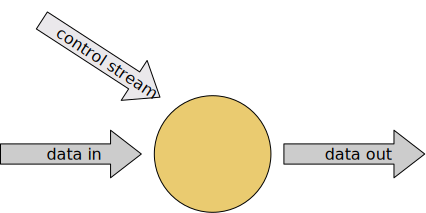

Apache Flink 的一种常见应用场景是 ETL（抽取、转换、加载）管道任务。从一个或多个数据源获取数据，进行一些转换操作和信息补充，将结果存储起来。在这个教程中，我们将介绍如何使用 Flink 的 DataStream API 实现这类应用。

这里注意，Flink 的 Table 和 SQL API 完全可以满足很多 ETL 使用场景。但无论你最终是否直接使用 DataStream API，对这里介绍的基本知识有扎实的理解都是有价值的。

# 无状态的转换

本节涵盖了 map() 和 flatmap()，这两种算子可以用来实现无状态转换的基本操作。

## map()

在第一个练习中，你将过滤出租车行程数据中的事件。在同一代码仓库中，有一个 `GeoUtils` 类，提供了一个静态方法 `GeoUtils.mapToGridCell(float lon, float lat)`，它可以将位置坐标（经度，维度）映射到 100x100 米的对应不同区域的网格单元。

现在让我们为每个出租车行程时间的数据对象增加 `startCell` 和 `endCell` 字段。你可以创建一个继承 `TaxiRide` 的 `EnrichedRide` 类，添加这些字段：

```java
public static class EnrichedRide extends TaxiRide {
    public int startCell;
    public int endCell;

    public EnrichedRide() {}

    public EnrichedRide(TaxiRide ride) {
        this.rideId = ride.rideId;
        this.isStart = ride.isStart;
        ...
        this.startCell = GeoUtils.mapToGridCell(ride.startLon, ride.startLat);
        this.endCell = GeoUtils.mapToGridCell(ride.endLon, ride.endLat);
    }

    public String toString() {
        return super.toString() + "," +
            Integer.toString(this.startCell) + "," +
            Integer.toString(this.endCell);
    }
}

```

然后你可以创建一个应用来转换这个流

```java
DataStream<TaxiRide> rides = env.addSource(new TaxiRideSource(...));

DataStream<EnrichedRide> enrichedNYCRides = rides
    .filter(new RideCleansingSolution.NYCFilter())
    .map(new Enrichment());

enrichedNYCRides.print();
```

## flatmap()

`MapFunction` 只适用于一对一的转换：对每个进入算子的流元素，`map()` 将仅输出一个转换后的元素。对于除此以外的场景，你将要使用 `flatmap()`。

```java
DataStream<TaxiRide> rides = env.addSource(new TaxiRideSource(...));

DataStream<EnrichedRide> enrichedNYCRides = rides
    .flatMap(new NYCEnrichment());

enrichedNYCRides.print();
```

其中用到的 FlatMapFunction :

```java
public static class NYCEnrichment implements FlatMapFunction<TaxiRide, EnrichedRide> {

    @Override
    public void flatMap(TaxiRide taxiRide, Collector<EnrichedRide> out) throws Exception {
        FilterFunction<TaxiRide> valid = new RideCleansing.NYCFilter();
        if (valid.filter(taxiRide)) {
            out.collect(new EnrichedRide(taxiRide));
        }
    }
}
```

使用接口中提供的 `Collector` ，`flatmap()` 可以输出你想要的任意数量的元素，也可以一个都不发。

# Keyed Streams

## keyBy()

将一个流根据其中的一些属性来进行分区是十分有用的，这样我们可以使所有具有相同属性的事件分到相同的组里。例如，如果你想找到从每个网格单元出发的最远的出租车行程。按 SQL 查询的方式来考虑，这意味着要对 `startCell` 进行 GROUP BY 再排序，在 Flink 中这部分可以用 `keyBy(KeySelector)` 实现。

```java
rides
    .flatMap(new NYCEnrichment())
    .keyBy(enrichedRide -> enrichedRide.startCell)
```

每个 `keyBy` 会通过 `shuffle` 来为数据流进行重新分区。总体来说这个开销是很大的，它涉及网络通信、序列化和反序列化。

## 通过计算得到键

`KeySelector` 不仅限于从事件中抽取键。你也可以按想要的方式计算得到键值，只要最终结果是确定的，并且实现了 `hashCode()` 和 `equals()`。这些限制条件不包括产生随机数或者返回 `Arrays` 或 `Enums` 的 `KeySelector`，但你可以用元组和 POJO 来组成键，只要他们的元素遵循上述条件

键必须按确定的方式产生，因为它们会在需要的时候被重新计算，而不是一直被带在流记录中。

例如，比起创建一个新的带有 `startCell` 字段的 `EnrichedRide` 类，用这个字段作为 `key`：

```java
keyBy(enrichedRide -> enrichedRide.startCell)
```

我们更倾向于这样做：

```java
keyBy(ride -> GeoUtils.mapToGridCell(ride.startLon, ride.startLat))
```

## Keyed Stream 的聚合

以下代码为每个行程结束事件创建了一个新的包含 `startCell` 和时长（分钟）的元组流：

```java
import org.joda.time.Interval;

DataStream<Tuple2<Integer, Minutes>> minutesByStartCell = enrichedNYCRides
    .flatMap(new FlatMapFunction<EnrichedRide, Tuple2<Integer, Minutes>>() {

        @Override
        public void flatMap(EnrichedRide ride,
                            Collector<Tuple2<Integer, Minutes>> out) throws Exception {
            if (!ride.isStart) {
                Interval rideInterval = new Interval(ride.startTime, ride.endTime);
                Minutes duration = rideInterval.toDuration().toStandardMinutes();
                out.collect(new Tuple2<>(ride.startCell, duration));
            }
        }
    });
```

现在就可以产生一个流，对每个 startCell 仅包含那些最长行程的数据。

有很多种方法表示使用哪个字段作为键。前面使用 EnrichedRide POJO 的例子，用字段名来指定键。而这个使用 `Tuple2` 对象的例子中，用字段在元组中的序号（从0开始）来指定键。

```java
minutesByStartCell
  .keyBy(value -> value.f0) // .keyBy(value -> value.startCell)
  .maxBy(1) // duration
  .print();
```

现在每次行程时长达到新的最大值，都会输出一条新记录，例如下面这个对应 50797 网格单元的数据：

```
...
4> (64549,5M)
4> (46298,18M)
1> (51549,14M)
1> (53043,13M)
1> (56031,22M)
1> (50797,6M)
...
1> (50797,8M)
...
1> (50797,11M)
...
1> (50797,12M)
```

## （隐式的）状态

这是培训中第一个涉及到有状态流的例子。尽管状态的处理是透明的，Flink 必须跟踪每个不同的键的最大时长。

只要应用中有状态，你就应该考虑状态的大小。如果键值的数量是无限的，那 Flink 的状态需要的空间也同样是无限的。

在流处理场景中，考虑有限窗口的聚合往往比整个流聚合更有意义。

## reduce() 和其他聚合算子

上面用到的 `maxBy()` 只是 Flink 中 `KeyedStream` 上众多聚合函数中的一个。还有一个更通用的 `reduce()` 函数可以用来实现你的自定义聚合。

# 有状态的转换

## Flink 为什么要参与状态管理？

在 Flink 不参与管理状态的情况下，你的应用也可以使用状态，但 Flink 为其管理状态提供了一些引人注目的特性：

- **本地性**: Flink 状态是存储在使用它的机器本地的，并且可以以内存访问速度来获取
- **持久性**: Flink 状态是容错的，例如，它可以自动按一定的时间间隔产生 checkpoint，并且在任务失败后进行恢复
- **纵向可扩展性**: Flink 状态可以存储在集成的 RocksDB 实例中，这种方式下可以通过增加本地磁盘来扩展空间
- **横向可扩展性**: Flink 状态可以随着集群的扩缩容重新分布
- **可查询性**: Flink 状态可以通过使用 状态查询 API 从外部进行查询。

在本节中你将学习如何使用 Flink 的 `API` 来管理 `keyed state`。

## Rich Functions

至此，你已经看到了 Flink 的几种函数接口，包括 `FilterFunction`， `MapFunction`，和 `FlatMapFunction`。这些都是单一抽象方法模式。

对其中的每一个接口，Flink 同样提供了一个所谓 “rich” 的变体，如 `RichFlatMapFunction`，其中增加了以下方法，包括：

- open(Configuration c)
- close()
- getRuntimeContext()

`open()` 仅在算子初始化时调用一次。可以用来加载一些静态数据，或者建立外部服务的链接等。

`getRuntimeContext()` 为整套潜在有趣的东西提供了一个访问途径，最明显的，它是你创建和访问 Flink 状态的途径。

## 一个使用 Keyed State 的例子

在这个例子里，想象你有一个要去重的事件数据流，对每个键只保留第一个事件。下面是完成这个功能的应用，使用一个名为 `Deduplicator` 的 `RichFlatMapFunction` ：

```java
private static class Event {
    public final String key;
    public final long timestamp;
    ...
}

public static void main(String[] args) throws Exception {
    StreamExecutionEnvironment env = StreamExecutionEnvironment.getExecutionEnvironment();
  
    env.addSource(new EventSource())
        .keyBy(e -> e.key)
        .flatMap(new Deduplicator())
        .print();
  
    env.execute();
}
```

为了实现这个功能，Deduplicator 需要记录每个键是否已经有了相应的记录。它将通过使用 Flink 的 `keyed state` 接口来做这件事。

当你使用像这样的 `keyed stream` 的时候，Flink 会为每个状态中管理的条目维护一个键值存储。

Flink 支持几种不同方式的 `keyed state`，这个例子使用的是最简单的一个，叫做 `ValueState`。意思是对于 每个键 ，Flink 将存储一个单一的对象 —— 在这个例子中，存储的是一个 Boolean 类型的对象。

我们的 `Deduplicator` 类有两个方法：`open()` 和 `flatMap()`。`open()` 方法通过定义 `ValueStateDescriptor<Boolean>` 建立了管理状态的使用。构造器的参数定义了这个状态的名字（“keyHasBeenSeen”），并且为如何序列化这些对象提供了信息（在这个例子中的 `Types.BOOLEAN`）。

```java
public static class Deduplicator extends RichFlatMapFunction<Event, Event> {
    ValueState<Boolean> keyHasBeenSeen;

    @Override
    public void open(Configuration conf) {
        ValueStateDescriptor<Boolean> desc = new ValueStateDescriptor<>("keyHasBeenSeen", Types.BOOLEAN);
        keyHasBeenSeen = getRuntimeContext().getState(desc);
    }

    @Override
    public void flatMap(Event event, Collector<Event> out) throws Exception {
        if (keyHasBeenSeen.value() == null) {
            out.collect(event);
            keyHasBeenSeen.update(true);
        }
    }
}
```

当 flatMap 方法调用 `keyHasBeenSeen.value()` 时，Flink 会在 当前键的上下文 中检索状态值，只有当状态为 `null` 时，才会输出当前事件。这种情况下，它同时也将更新 `keyHasBeenSeen` 为 `true`。

这种访问和更新按键分区的状态的机制也许看上去很神奇，因为在 `Deduplicator` 的实现中，键不是明确可见的。当 Flink 运行时调用 `RichFlatMapFunction` 的 `open` 方法时， 是没有事件的，所以这个时候上下文中不含有任何键。但当它调用 `flatMap` 方法，被处理的事件的键在运行时中就是可用的了，并且被用来确定操作哪个 Flink 状态后端的入口。

部署在分布式集群时，将会有很多 `Deduplicator` 的实例，每一个实例将负责整个键空间的互斥子集中的一个。所以，当你看到一个单独的 `ValueState`，比如

```java
ValueState<Boolean> keyHasBeenSeen;
```

要理解这个代表的不仅仅是一个单独的布尔类型变量，而是一个分布式的共享键值存储。

## 清理状态

上面例子有一个潜在的问题：当键空间是无界的时候将发生什么？Flink 会对每个使用过的键都存储一个 `Boolean` 类型的实例。如果是键是有限的集合还好，但在键无限增长的应用中，清除再也不会使用的状态是很必要的。这通过在状态对象上调用 `clear()` 来实现，如下：

```java
keyHasBeenSeen.clear()
```

对一个给定的键值，你也许想在它一段时间不使用后来做这件事。当学习 `ProcessFunction` 的相关章节时，你将看到在事件驱动的应用中怎么用定时器来做这个。

也可以选择使用 状态的过期时间（TTL），为状态描述符配置你想要旧状态自动被清除的时间。

## Non-keyed State

在没有键的上下文中我们也可以使用 Flink 管理的状态。这也被称作 算子的状态。它包含的接口是很不一样的，由于对用户定义的函数来说使用 `non-keyed state` 是不太常见的，所以这里就不多介绍了。这个特性最常用于 `source` 和 `sink` 的实现。

# Connected Streams

相比于下面这种预先定义的转换：


有时你想要更灵活地调整转换的某些功能，比如数据流的阈值、规则或者其他参数。Flink 支持这种需求的模式称为 connected streams ，一个单独的算子有两个输入流。



connected stream 也可以被用来实现流的关联。

## 示例

在这个例子中，一个控制流是用来指定哪些词需要从 `streamOfWords` 里过滤掉的。 一个称为 `ControlFunction` 的 `RichCoFlatMapFunction` 作用于连接的流来实现这个功能。

```java
public static void main(String[] args) throws Exception {
    StreamExecutionEnvironment env = StreamExecutionEnvironment.getExecutionEnvironment();

    DataStream<String> control = env
        .fromElements("DROP", "IGNORE")
        .keyBy(x -> x);

    DataStream<String> streamOfWords = env
        .fromElements("Apache", "DROP", "Flink", "IGNORE")
        .keyBy(x -> x);
  
    control
        .connect(streamOfWords)
        .flatMap(new ControlFunction())
        .print();

    env.execute();
}
```

这里注意两个流只有键一致的时候才能连接。 `keyBy` 的作用是将流数据分区，当 `keyed stream` 被连接时，他们必须按相同的方式分区。这样保证了两个流中所有键相同的事件发到同一个实例上。这样也使按键关联两个流成为可能。

在这个例子中，两个流都是 `DataStream<String>` 类型的，并且都将字符串作为键。正如你将在下面看到的，`RichCoFlatMapFunction` 在状态中存了一个布尔类型的变量，这个变量被两个流共享。

```java
public static class ControlFunction extends RichCoFlatMapFunction<String, String, String> {
    private ValueState<Boolean> blocked;
      
    @Override
    public void open(Configuration config) {
        blocked = getRuntimeContext()
            .getState(new ValueStateDescriptor<>("blocked", Boolean.class));
    }
      
    @Override
    public void flatMap1(String control_value, Collector<String> out) throws Exception {
        blocked.update(Boolean.TRUE);
    }
      
    @Override
    public void flatMap2(String data_value, Collector<String> out) throws Exception {
        if (blocked.value() == null) {
            out.collect(data_value);
        }
    }
}
```

`RichCoFlatMapFunction` 是一种可以被用于一对连接流的 `FlatMapFunction`，并且它可以调用 `rich function `的接口。这意味着它可以是有状态的。

布尔变量 `blocked` 被用于记录在数据流 `control` 中出现过的键（在这个例子中是单词），并且这些单词从 `streamOfWords` 过滤掉。这是 `keyed state`，并且它是被两个流共享的，这也是为什么两个流必须有相同的键值空间。

在 Flink 运行时中，`flatMap1` 和 `flatMap2` 在连接流有新元素到来时被调用 —— 在我们的例子中，`control` 流中的元素会进入 `flatMap1`，`streamOfWords` 中的元素会进入 `flatMap2`。这是由两个流连接的顺序决定的，本例中为 `control.connect(streamOfWords)`。

认识到你没法控制 `flatMap1` 和 `flatMap2` 的调用顺序是很重要的。这两个输入流是相互竞争的关系，Flink 运行时将根据从一个流或另一个流中消费的事件做它要做的。对于需要保证时间和/或顺序的场景，你会发现在 Flink 的管理状态中缓存事件一直到它们能够被处理是必须的。（注意：如果你真的感到绝望，可以使用自定义的算子实现 InputSelectable 接口，在两输入算子消费它的输入流时增加一些顺序上的限制。）

