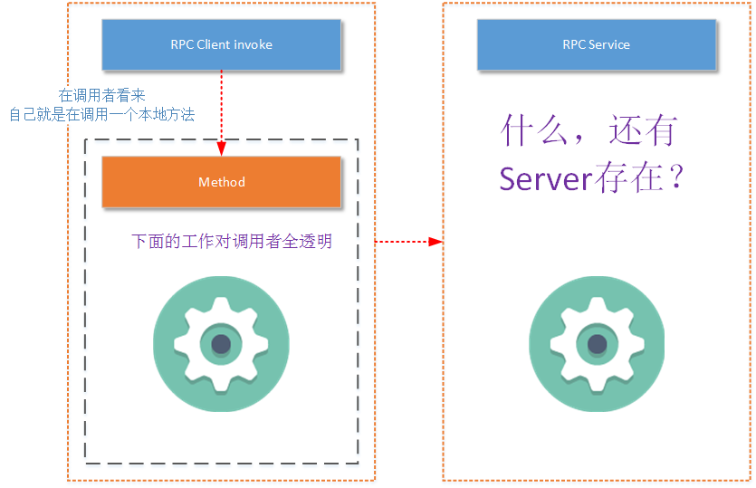
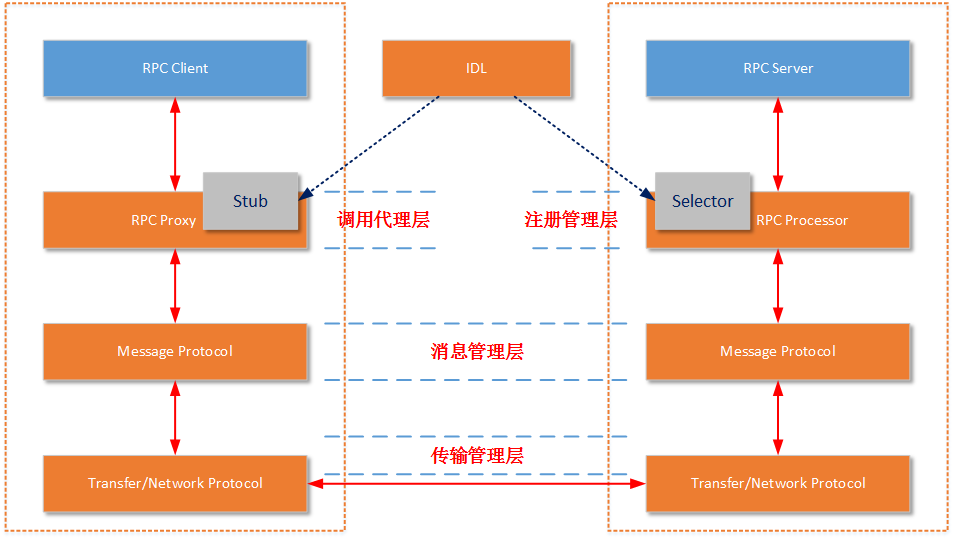
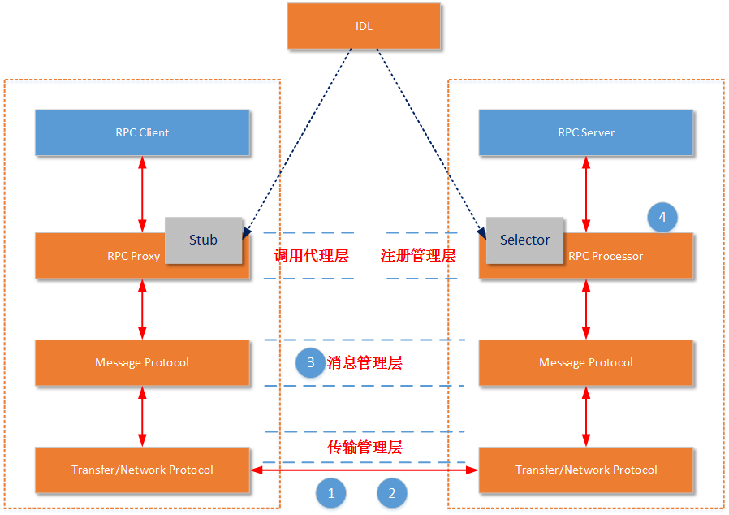

# 概述
## 什么是RPC
RPC（Remote Procedure Call Protocol）远程过程调用协议。一个通俗的描述是：客户端在不知道调用细节的情况下，调用存在于远程计算机上的某个对象，就像调用本地应用程序中的对象一样。比较正式的描述是：一种通过网络从远程计算机程序上请求服务，而不需要了解底层网络技术的协议。那么我们至少从这样的描述中挖掘出几个要点：

- RPC是协议：既然是协议就只是一套规范，那么就需要有人遵循这套规范来进行实现。目前典型的RPC实现包括：Dubbo、Thrift、GRPC、Hetty等。这里要说明一下，目前技术的发展趋势来看，实现了RPC协议的应用工具往往都会附加其他重要功能，例如Dubbo还包括了服务管理、访问权限管理等功能。

- 网络协议和网络IO模型对其透明：既然RPC的客户端认为自己是在调用本地对象。那么传输层使用的是TCP/UDP还是HTTP协议，又或者是一些其他的网络协议它就不需要关心了。既然网络协议对其透明，那么调用过程中，使用的是哪一种网络IO模型调用者也不需要关心。

- 信息格式对其透明：我们知道在本地应用程序中，对于某个对象的调用需要传递一些参数，并且会返回一个调用结果。至于被调用的对象内部是如何使用这些参数，并计算出处理结果的，调用方是不需要关心的。那么对于远程调用来说，这些参数会以某种信息格式传递给网络上的另外一台计算机，这个信息格式是怎样构成的，调用方是不需要关心的。

- 应该有跨语言能力：为什么这样说呢？因为调用方实际上也不清楚远程服务器的应用程序是使用什么语言运行的。那么对于调用方来说，无论服务器方使用的是什么语言，本次调用都应该成功，并且返回值也应该按照调用方程序语言所能理解的形式进行描述。

那么上面的描述情况可以用下图表示：

## RPC要素

上图是作为RPC的调用者所观察到的现象（而实际情况是客户端或多或少的还是需要知道一些调用RPC的细节）。但是我们是要讲解RPC的基本概念，所以RPC协议内部是怎么回事就要说清楚：

- Client：RPC协议的调用方。就像上文所描述的那样，最理想的情况是RPC Client在完全不知道有RPC框架存在的情况下发起对远程服务的调用。但实际情况来说Client或多或少的都需要指定RPC框架的一些细节。

- Server：在RPC规范中，这个Server并不是提供RPC服务器IP、端口监听的模块。而是远程服务方法的具体实现（在JAVA中就是RPC服务接口的具体实现）。其中的代码是最普通的和业务相关的代码，甚至其接口实现类本身都不知道将被某一个RPC远程客户端调用。

- Stub/Proxy：RPC代理存在于客户端，因为要实现客户端对RPC框架“透明”调用，那么客户端不可能自行去管理消息格式、不可能自己去管理网络传输协议，也不可能自己去判断调用过程是否有异常。这一切工作在客户端都是交给RPC框架中的“代理”层来处理的。

- Message Protocol：在上文我们已经说到，一次完整的client-server的交互肯定是携带某种两端都能识别的，共同约定的消息格式。RPC的消息管理层专门对网络传输所承载的消息信息进行编号和解码操作。目前流行的技术趋势是不同的RPC实现，为了加强自身框架的效率都有一套（或者几套）私有的消息格式。例如前文所讲到的RMI框架使用的消息协议为JRMP；后文我们将详细讲解的RPC框架Thrift也有私有的消息协议，“- Transfer/Network Protocol”（当然它还支持一些通用的消息格式，如JSON）。

- Transfer/Network Protocol：传输协议层负责管理RPC框架所使用的网络协议、网络IO模型。例如Hessian的传输协议基于HTTP（应用层协议）；而Thrift的传输协议基于TCP（传输层协议）。传输层还需要统一RPC客户端和RPC服务端所使用的IO模型；

- Selector/Processor：存在于RPC服务端，由于服务器端某一个RPC接口的实现的特性（它并不知道自己是一个将要被RPC提供给第三方系统调用的服务）。所以在RPC框架中应该有一种“负责执行RPC接口实现”的角色。它负责了包括：管理RPC接口的注册、判断客户端的请求权限、控制接口实现类的执行在内的各种工作。

- IDL：实际上IDL（接口定义语言）并不是RPC实现中所必须的。但是需要跨语言的RPC框架一定会有IDL部分的存在。这是因为要找到一个各种语言能够理解的消息结构、接口定义的描述形式。如果您的RPC实现没有考虑跨语言性，那么IDL部分就不需要包括，例如JAVA RMI因为就是为了在JAVA语言间进行使用，所以JAVA RMI就没有相应的IDL。

- 一定要说明一点，不同的RPC框架实现都有一定设计差异。例如生成Stub的方式不一样，IDL描述语言不一样、服务注册的管理方式不一样、运行服务实现的方式不一样、采用的消息格式封装不一样、采用的网络协议不一样。但是基本的思路都是一样的，上图中的所列出的要素也都是具有的。

## 典型的RPC框架介绍
- JAVA RMI：是不是觉得前文中我们介绍RMI所提到几个关键概念在RPC中都找得到一些影子。是的，RPC最早就是由SUN提出，并在后来由IETF ONC修订。RMI就是一个典型的RPC实现，只不过RMI不支持跨语言性，所以RMI中也没有IDL存在的必要。但是RMI真心快，并且由于没有IDL的存在，在构建一套完整的RPC实现时要比其他RPC框架少了一些步骤，所以使用起来也比较简单。如果您的业务需求中并不存在跨语言的考虑，并且基本上主要系统都是用JAVA实现，那么RMI绝对是您一个可以考虑的方案。

- GRPC：GRPC是一个高性能、通用的开源RPC框架，由Google主要面向移动应用开发并基于HTTP/2协议（ 注意是HTTP/2协议，不是我们常使用的HTTP 1_1。HTTP/2协议详细的介绍可以参见官方地址：https://http2.github.io/ ）标准而设计，基于ProtoBuf(Protocol Buffers)序列化协议开发，且支持众多开发语言。为了支持GRPC的跨语言性，GRPC有一套独立存在IDL语言。不过由于GRPC是Google的开源产品，在信息格式封装方面Google主要还是推广的自己的ProtoBuf，所以GPRC是不支持其他信息格式的（至少ProtoBuf效率是大家有目共睹的）。关于GRPC详细的使用介绍，可以参见官方地址：https://github.com/grpc/grpc

- Thrift：Thrift是Facebook的一个开源项目，后来进入Apache进行孵化。Thrift也是支持跨语言的，所以它有自己的一套IDL。目前它支持几乎所有主流的编程语言：C++, Java, Python, PHP, Ruby, Erlang, Perl, Haskell, C#, Cocoa, JavaScript, Node.js, Smalltalk, OCaml and Delphi and other languages。Thrift可以支持多种信息格式，除了Thrift私有的二进制编码规则和一种LVQ（类似于TLV消息格式）的消息格式，还有常规的JSON格式。Thrift的网络协议建立在TCP协议基础上，并且支持阻塞式IO模型和多路IO复用模型。我们将在后文详细讲解Apache Thrift的使用。Thrift也是目前最流行的RPC框架之一，从网络上各种性能测试情况开，Thrift的性能都是领先的。Thrift的官网地址为：http://thrift.apache.org/

- Hetty：Hetty是一款构建于Netty和Hessian基础上的高性能的RPC框架。在前几篇文章中，我已经详细讲述了使用Netty进行网络处理和直接使用JAVA原生的IO模型进行网络处理所带来的好处。Hetty的网络协议基于HTTP，由于采用了Netty，所以Hetty支持阻塞式IO模型和多路IO复用模型。Hetty的消息格式采用私有的二进制流格式。

- Dubbo：Dubbo是Alibaba开源的分布式服务框架。注意我说的是分布式服务框架，不是RPC框架（用比较严谨的词语概括，应该是“服务治理框架”）。除了集成RPC的规范外，Dubbo还在RPC的上层搭建服务层功能、配置层功能、服务路由功能（加上真正的RPC规范实现总共有10层）。在后文讲解“服务治理”时会重点讲解Dubbo的原理和使用。

- 其他的RPC框架：除了上诉的RPC协议的实现外，还有：Wildfly、Hprose等等。Hprose是一款国人主导的RPC实现，感兴趣的读者可以去看看（ http://www.hprose.com/ ）。另外基于RPC的定义，Xfire，CXF这些Web Service框架也属于RPC：WSDL描述文件就是他们的IDL，通过WSDL为不同的编程语言生成Stub、通过不同的Web服务器管理具体服务实现的运行过程、HTTP是它们的通信协议、XML是它们的消息格式。

## RPC框架的性能依据

在物理服务器性能相同的情况下，以下几个因素会对一款RPC框架的性能产生直接影响：

- 所支持的网络IO模型：您的RPC服务器可以只支持传统的阻塞式同步IO，也可以做一些改进让您的RPC服务器支持非阻塞式同步IO，或者在您的服务器上实现对多路IO模型的支持。这样的RPC服务器的性能在高并发状态下，会有很大的差别。特别是单位处理性能下对内存、CPU资源的使用率。

- 基于的网络协议：一般来说您可以选择让您的RPC使用应用层协议，例如HTTP或者之前我们提到的HTTP/2协议，或者使用TCP协议，让您的RPC框架工作在传输层。工作在哪一层网络上会对RPC框架的工作性能产生一定的影响，但是对RPC最终的性能影响并不大。但是至少从各种主流的RPC实现来看，没有采用UDP协议做为主要的传输协议的。

- 选择的消息封装格式：选择或者定义一种消息格式的封装，要考虑的问题包括：消息的易读性、描述单位内容时的消息体大小、编码难度、解码难度、解决半包/粘包问题的难易度。当然如果您只是想定义一种RPC专用的消息格式，那么消息的易读性可能不是最需要考虑的。消息封装格式的设计是目前各种RPC框架性能差异的最重要原因，这就是为什么几乎所有主流的RPC框架都会设计私有的消息封装格式的原因。

- 实现的服务处理管理方式：在高并发请求下，如何管理注册的服务也是一个性能影响点。您可以让RPC的Selector/Processor使用单个线程运行服务的具体实现（这意味着上一个客户端的请求没有处理完，下一个客户端的请求就需要等待）、您也可以为每一个RPC具体服务的实现开启一个独立的线程运行（可以一次处理多个请求，但是操作系统对于“可运行的最大线程数”是有限制的）、您也可以线程池来运行RPC具体的服务实现（目前看来，在单个服务节点的情况下，这种方式是比较好的）、您还可以通过注册代理的方式让多个服务节点来运行具体的RPC服务实现。