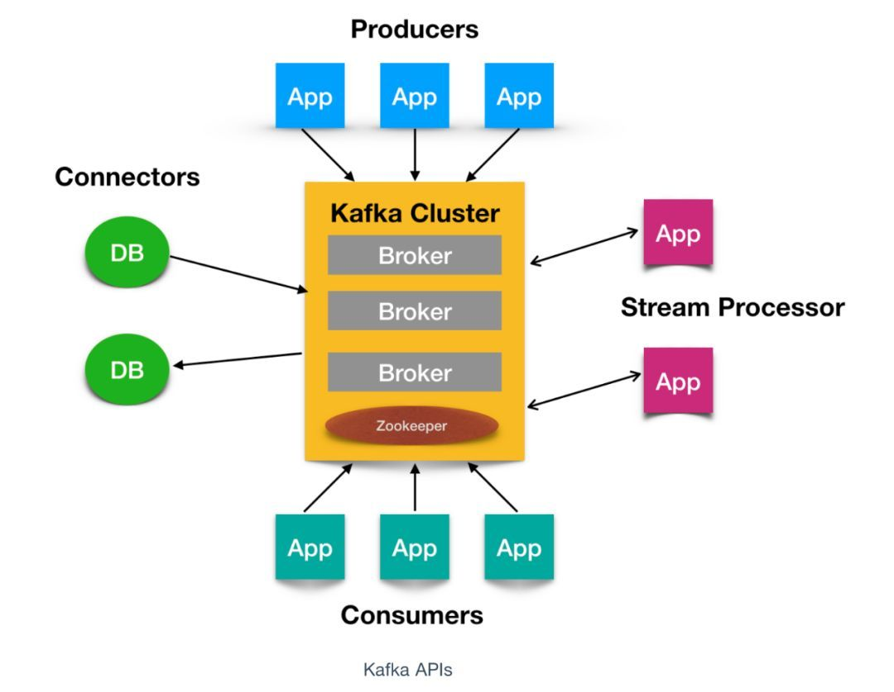

https://cloud.tencent.com/developer/article/1547380

# 简介
Kafka 是由 `Linkedin` 公司开发的，它是一个分布式的，支持多分区、多副本，基于 Zookeeper 的分布式消息流平台，它同时也是一款开源的**基于发布订阅模式的消息引擎系统**。

# 消息系统
queue : 消息队列
topic : 主题

- 点对点消息系统：生产者发送一条消息到queue，一个queue可以有很多消费者，但是一个消息只能被一个消费者接受，当没有消费者可用时，这个消息会被保存直到有 一个可用的消费者，所以Queue实现了一个可靠的负载均衡。

- 发布订阅消息系统：发布者发送到topic的消息，只有订阅了topic的订阅者才会收到消息。topic实现了发布和订阅，当你发布一个消息，所有订阅这个topic的服务都能得到这个消息，所以从1到N个订阅者都能得到这个消息的拷贝。

# 特性
- **高吞吐、低延迟**：kakfa 最大的特点就是收发消息非常快，kafka 每秒可以处理几十万条消息，它的最低延迟只有几毫秒。
- **高伸缩性**：每个主题(topic) 包含多个分区(partition)，主题中的分区可以分布在不同的主机(broker)中。
- **持久性、可靠性**：Kafka 能够允许数据的持久化存储，消息被持久化到磁盘，并支持数据备份防止数据丢失，Kafka 底层的数据存储是基于 Zookeeper 存储的，Zookeeper 我们知道它的数据能够持久存储。
- **容错性**：允许集群中的节点失败，某个节点宕机，Kafka 集群能够正常工作
- **高并发**：支持数千个客户端同时读写

# 使用场景
- **活动跟踪**：Kafka 可以用来跟踪用户行为，比如我们经常回去淘宝购物，你打开淘宝的那一刻，你的登陆信息，登陆次数都会作为消息传输到 Kafka ，当你浏览购物的时候，你的浏览信息，你的搜索指数，你的购物爱好都会作为一个个消息传递给 Kafka ，这样就可以生成报告，可以做智能推荐，购买喜好等。
- **传递消息**：Kafka 另外一个基本用途是传递消息，应用程序向用户发送通知就是通过传递消息来实现的，这些应用组件可以生成消息，而不需要关心消息的格式，也不需要关心消息是如何发送的。
- **度量指标**：Kafka也经常用来记录运营监控数据。包括收集各种分布式应用的数据，生产各种操作的集中反馈，比如报警和报告。
- **日志记录**：Kafka 的基本概念来源于提交日志，比如我们可以把数据库的更新发送到 Kafka 上，用来记录数据库的更新时间，通过kafka以统一接口服务的方式开放给各种consumer，例如hadoop、Hbase、Solr等。
- **流式处理**：流式处理是有一个能够提供多种应用程序的领域。
- **限流削峰**：Kafka 多用于互联网领域某一时刻请求特别多的情况下，可以把请求写入Kafka 中，避免直接请求后端程序导致服务崩溃。

# Kafka 术语
**消息**：Kafka 中的数据单元被称为`消息`，也被称为记录，可以把它看作数据库表中某一行的记录。

**批次**：为了提高效率， 消息会`分批次`写入 Kafka，批次就代指的是一组消息。

消息由producer产生，消息按照topic归类，并发送到broker中，broker中保存了一个或多个topic的消息，consumer通过订阅一组topic的消息，通过持续的poll操作从broker获取消息，并进行后续的消息处理。

**Producer** ：消息生产者，就是向broker发指定topic消息的客户端。

**Consumer** ：消息消费者，通过订阅一组topic的消息，从broker读取消息的客户端。

**Broker** ：一个kafka集群包含一个或多个服务器，一台kafka服务器就是一个broker，用于保存producer发送的消息。一个broker可以容纳多个topic。

**Topic** ：每条发送到broker的消息都有一个类别，可以理解为一个队列或者数据库的一张表。

**Partition** ：一个topic的消息由多个partition队列存储的，一个partition队列在kafka上称为一个分区。每个partition是一个有序的队列，多个partition间则是无序的。partition中的每条消息都会被分配一个有序的id（offset）。

**Offset** ：偏移量。kafka为每条在分区的消息保存一个偏移量offset，这也是消费者在分区的位置。kafka的存储文件都是按照offset.kafka来命名，位于2049位置的即为2048.kafka的文件。比如一个偏移量是5的消费者，表示已经消费了从0-4偏移量的消息，下一个要消费的消息的偏移量是5。

**Consumer Group （CG）** ：若干个Consumer组成的集合。这是kafka用来实现一个topic消息的广播（发给所有的consumer）和单播（发给任意一个consumer）的手段。一个topic可以有多个CG。topic的消息会复制（不是真的复制，是概念上的）到所有的CG，但每个CG只会把消息发给该CG中的一个consumer。如果需要实现广播，只要每个consumer有一个独立的CG就可以了。要实现单播只要所有的consumer在同一个CG。用CG还可以将consumer进行自由的分组而不需要多次发送消息到不同的topic。

**Replica**：Kafka 中消息的备份又叫做 副本（Replica），副本的数量是可以配置的，Kafka 定义了两类副本：领导者副本（Leader Replica） 和 追随者副本（Follower Replica），前者对外提供服务，后者只是被动跟随。

**Rebalance**：Rebalance。消费者组内某个消费者实例挂掉后，其他消费者实例自动重新分配订阅主题分区的过程。Rebalance 是 Kafka 消费者端实现高可用的重要手段。

# kafka 消息队列
Kafka 的消息队列一般分为两种模式：**点对点模式**和**发布订阅模式**

Kafka 是支持消费者群组的，也就是说 Kafka 中会有一个或者多个消费者，如果一个生产者生产的消息由一个消费者进行消费的话，那么这种模式就是点对点模式

如果一个生产者或者多个生产者产生的消息能够被多个消费者同时消费的情况，这样的消息队列成为发布订阅模式的消息队列

# Kafka 系统架构

如上图所示，一个典型的 Kafka 集群中包含若干Producer（可以是web前端产生的Page View，或者是服务器日志，系统CPU、Memory等），若干broker（Kafka支持水平扩展，一般broker数量越多，集群吞吐率越高），若干Consumer Group，以及一个Zookeeper集群。Kafka通过Zookeeper管理集群配置，选举leader，以及在Consumer Group发生变化时进行rebalance。Producer使用push模式将消息发布到broker，Consumer使用pull模式从broker订阅并消费消息。

# Kafka 核心API
Kafka 有四个核心API，它们分别是

- Producer API，它允许应用程序向一个或多个 topics 上发送消息记录
- Consumer API，允许应用程序订阅一个或多个 topics 并处理为其生成的记录流
- Streams API，它允许应用程序作为流处理器，从一个或多个主题中消费输入流并为其生成输出流，有效的将输入流转换为输出流。
- Connector API，它允许构建和运行将 Kafka 主题连接到现有应用程序或数据系统的可用生产者和消费者。例如，关系数据库的连接器可能会捕获对表的所有更改

# Kafka 速度为什么快
Kafka 实现了`零拷贝`原理来快速移动数据，避免了内核之间的切换。Kafka 可以将数据记录分批发送，从生产者到文件系统（Kafka 主题日志）到消费者，可以端到端的查看这些批次的数据。

批处理能够进行更有效的数据压缩并减少 I/O 延迟，Kafka 采取顺序写入磁盘的方式，避免了随机磁盘寻址的浪费

总结一下其实就是四个要点

- 顺序读写
- 零拷贝
- 消息压缩
- 分批发送

# Kafka 重要配置
## broker 端配置
+ `broker.id`
每个 kafka broker 都有一个唯一的标识来表示，这个唯一的标识符即是 `broker.id`，它的默认值是 0。这个值在 kafka 集群中必须是唯一的，这个值可以任意设定，

- `port`
如果使用配置样本来启动 kafka，它会监听 9092 端口。修改 port 配置参数可以把它设置成任意的端口。要注意，如果使用 1024 以下的端口，需要使用 root 权限启动 kakfa。

+ `zookeeper.connect`
用于保存 broker 元数据的 Zookeeper 地址是通过 `zookeeper.connect` 来指定的。比如我可以这么指定 `localhost:2181`表示这个 Zookeeper 是运行在本地 2181 端口上的。比如我们可以通过 `zk1:2181,zk2:2181,zk3:2181`来指定 zookeeper.connect 的多个参数值。该配置参数是用冒号分割的一组 `hostname:port/path` 列表，其含义如下

`hostname` 是 Zookeeper 服务器的机器名或者 ip 地址。

`port` 是 Zookeeper 客户端的端口号

`/path` 是可选择的 Zookeeper 路径，Kafka 路径是使用了 chroot 环境，如果不指定默认使用跟路径。

>如果有两套 Kafka 集群，假设分别叫它们 `kafka1` 和 `kafka2`，那么两套集群的zookeeper.connect参数可以这样指定：`zk1:2181,zk2:2181,zk3:2181/kafka1`和`zk1:2181,zk2:2181,zk3:2181/kafka2`

- `log.dirs`
Kafka 把所有的消息都保存到磁盘上，存放这些日志片段的目录是通过 `log.dirs`来制定的，它是用一组逗号来分割的本地系统路径，`log.dirs` 是没有默认值的，你必须**手动指定他的默认值**。其实还有一个参数是 `log.dir`，，默认情况下只用配置 `log.dirs` 就好了，比如你可以通过 `/home/kafka1,/home/kafka2,/home/kafka3`这样来配置这个参数的值。

+ `num.recovery.threads.per.data.dir`
对于如下3种情况，Kafka 会使用可配置的线程池来处理日志片段。

服务器正常启动，用于打开每个分区的日志片段；

服务器崩溃后重启，用于检查和截断每个分区的日志片段；

服务器正常关闭，用于关闭日志片段。

默认情况下，每个日志目录只使用一个线程。因为这些线程只是在服务器启动和关闭时会用到，所以完全可以设置大量的线程来达到井行操作的目的。特别是对于包含大量分区的服务器来说，一旦发生崩愤，在进行恢复时使用井行操作可能会省下数小时的时间。设置此参数时需要注意，所配置的数字对应的是 log.dirs 指定的单个日志目录。也就是说，如果 `num.recovery.threads.per.data.dir` 被设为 8，并且 `log.dir` 指定了 3 个路径，那么总共需要 24 个线程。

- `auto.create.topics.enable`
默认情况下，kafka 会使用三种方式来自动创建主题，下面是三种情况：

当一个生产者开始往主题写入消息时

当一个消费者开始从主题读取消息时

当任意一个客户端向主题发送元数据请求时

`auto.create.topics.enable` 参数建议最好设置成 false，即不允许自动创建 Topic。在我们的线上环境里面有很多名字稀奇古怪的 Topic，我想大概都是因为该参数被设置成了 true 的缘故。

## 主题默认配置

- `num.partitions`
`num.partitions` 参数指定了新创建的主题需要包含多少个分区。如果启用了主题自动创建功能（该功能是默认启用的），主题分区的个数就是该参数指定的值。该参数的默认值是 1。要注意，我们可以增加主题分区的个数，但不能减少分区的个数。

+ `default.replication.factor`
这个参数比较简单，它表示 kafka保存消息的副本数，如果一个副本失效了，另一个还可以继续提供服务`default.replication.factor` 的默认值为1，这个参数在你启用了主题自动创建功能后有效。

- `log.retention.ms`
Kafka 通常根据时间来决定数据可以保留多久。默认使用 `log.retention.hours` 参数来配置时间，默认是 168 个小时，也就是一周。除此之外，还有两个参数 `log.retention.minutes` 和 `log.retentiion.ms` 。这三个参数作用是一样的，都是决定消息多久以后被删除，推荐使用 `log.retention.ms`。

+ `log.retention.bytes`
另一种保留消息的方式是判断消息是否过期。它的值通过参数 `log.retention.bytes` 来指定，作用在每一个分区上。也就是说，如果有一个包含 8 个分区的主题，并且 `log.retention.bytes` 被设置为 1GB，那么这个主题最多可以保留 8GB 数据。所以，当主题的分区个数增加时，整个主题可以保留的数据也随之增加。

- `log.segment.bytes`
上述的日志都是作用在日志片段上，而不是作用在单个消息上。当消息到达 broker 时，它们被追加到分区的当前日志片段上，当日志片段大小到达 `log.segment.bytes` 指定上限（默认为 1GB）时，当前日志片段就会被关闭，一个新的日志片段被打开。如果一个日志片段被关闭，就开始等待过期。这个参数的值越小，就越会频繁的关闭和分配新文件，从而降低磁盘写入的整体效率。

+ `log.segment.ms`
上面提到日志片段经关闭后需等待过期，那么 `log.segment.ms` 这个参数就是指定日志多长时间被关闭的参数和，`log.segment.ms` 和 `log.retention.bytes` 也不存在互斥问题。日志片段会在大小或时间到达上限时被关闭，就看哪个条件先得到满足。

- `message.max.bytes`
broker 通过设置 `message.max.bytes`参数来限制单个消息的大小，默认是 1000 000， 也就是 1MB，如果生产者尝试发送的消息超过这个大小，不仅消息不会被接收，还会收到 broker 返回的错误消息。跟其他与字节相关的配置参数一样，该参数指的是压缩后的消息大小，也就是说，只要压缩后的消息小于 `mesage.max.bytes`，那么消息的实际大小可以大于这个值

这个值对性能有显著的影响。值越大，那么负责处理网络连接和请求的线程就需要花越多的时间来处理这些请求。它还会增加磁盘写入块的大小，从而影响 IO 吞吐量。

+ `retention.ms`
规定了该主题消息被保存的时常，默认是7天，即该主题只能保存7天的消息，一旦设置了这个值，它会覆盖掉 Broker 端的全局参数值。

- `retention.bytes`
规定了要为该 Topic 预留多大的磁盘空间。和全局参数作用相似，这个值通常在多租户的 Kafka 集群中会有用武之地。当前默认值是 -1，表示可以无限使用磁盘空间。

## JVM参数配置
JDK 版本一般推荐直接使用 JDK1.8，这个版本也是现在中国大部分程序员的首选版本。

说到 JVM 端设置，就绕不开`堆`这个话题，业界最推崇的一种设置方式就是直接将 JVM 堆大小设置为 6GB，这样会避免很多 Bug 出现。

Java8 默认的G1 收集器只需调整这两个参数

- `MaxGCPauseMillis`
该参数指定每次垃圾回收默认的停顿时间。该值不是固定的，G1可以根据需要使用更长的时间。它的默认值是 200ms，也就是说，每一轮垃圾回收大概需要200 ms 的时间。

+ `InitiatingHeapOccupancyPercent`
该参数指定了 G1 启动新一轮垃圾回收之前可以使用的堆内存百分比，默认值是45，这就表明G1在堆使用率到达45之前不会启用垃圾回收。这个百分比包括新生代和老年代。

