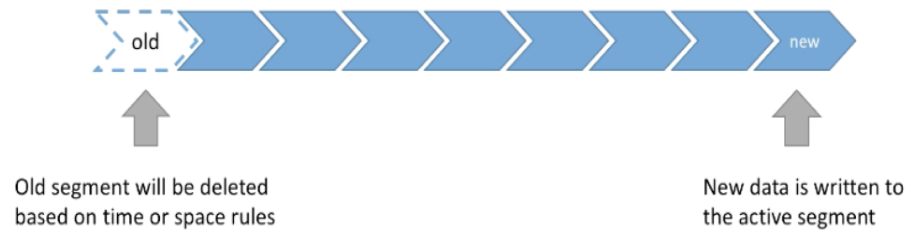
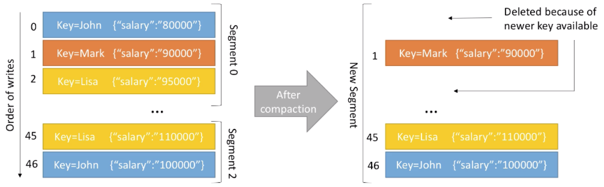
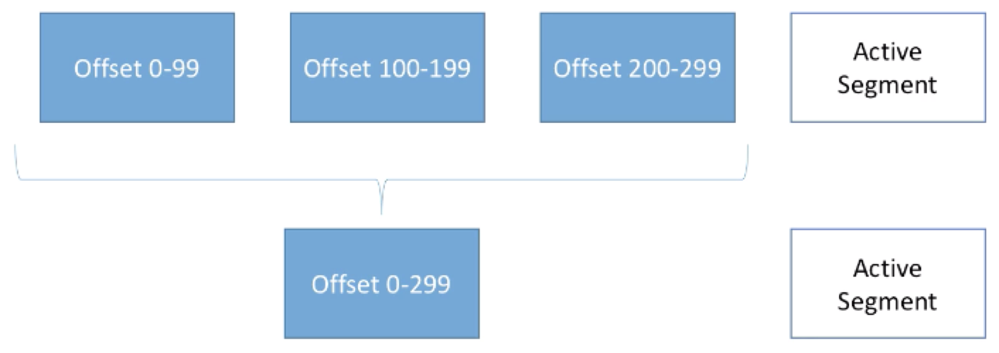

# Log Cleanup 策略

在Kafka中，存在数据过期的机制，称为data expire。如何处理过期数据是根据指定的policy（策略）决定的，而处理过期数据的行为，即为log cleanup。

在Kafka中有以下几种处理过期数据的策略：

- log.cleanup.policy=delete（Kafka中所有用户创建的topics，默认均为此策略）

  - 根据数据已保存的时间，进行删除（默认为1周）

  - 根据log的max size，进行删除（默认为-1，也就是无限制）

- log.cleanup.policy=compact（topic __consumer_offsets 默认为此策略）

  - 根据messages中的key，进行删除操作

  - 在active segment 被commit 后，会删除掉old duplicate keys

  - 无限制的时间与空间的日志保留

 自动清理Kafka中的数据可以控制磁盘上数据的大小、删除不需要的数据，同时也减少了对Kafka集群的维护成本。

 那Log cleanup 在什么时候发生呢？

- 首先值得注意的是：log cleanup 在`partition segment` 上发生

- 更小/更多的segment，也就意味着log cleanup 发生的频率会上升

- Log cleanup 不应该频繁发生=> 因为它会消耗CPU与内存资源

- Cleaner的检查会在每15秒进行一次，由log.cleaner.backoff.ms 控制

## log.cleanup.policy=delete

log.cleanup.policy=delete 的策略，根据数据保留的时间、以及log的max size，对数据进行cleanup。控制数据保留时间以及log max size的参数分别为：

- log.retention.hours：指定数据保留的时常（默认为一周，168）

  - 将参数调整到更高的值，也就意味着会占据更多的磁盘空间

  - 更小值意味着保存的数据量会更少（假如consumer 宕机超过一周，则数据便会再未处理前即丢失）

- log.retention.bytes：每个partition中保存的最大数据量大小（默认为-1，也就是无限大）

  - 再控制log的大小不超过一个阈值时，会比较有用

在到达log cleanup 的条件后，cleaner会自动根据时间或是空间的规则进行删除，新数据仍写入active segment：

针对于这个参数，一般有以下两种使用场景，分别为：

- log保留周期为一周，根据log保留期进行log cleanup：

  - log.retention.hours=168 以及 log.retention.bytes=-1

- log保留期为无限制，根据log大小进行进行log cleanup：

  - log.retention.hours=17520以及 log.retention.bytes=524288000

其中第一个场景会更常见。

## Log Compaction

Log compaction用于确保：在一个partition中，对任意一个key，它所对应的value都是最新的。

这里举个例子：我们有个topic名为employee-salary，我们希望维护每个employee当前最新的工资情况。

左边的是compaction前，segments中的数据，右边为compaction 后，segments中的数据，其中有部分key对应的value有更新：

可以看到在log compaction后，相对于更新后的key-value message，旧的message被删除。

Log Compaction 有如下特点：

- messages的顺序仍然是保留的，log compaction 仅移除一些messages，但不会重新对它们进行排序

- 一条message的offset是无法改变的（immutable），如果一条message缺失，则offset会直接被跳过

- 被删除的records在一段时间内仍然可以被consumers访问到，这段时间由参数delete.retention.ms（默认为24小时）控制

需要注意的是：Kafka 本身是不会组织用户发送duplicate data的。这些重复数据也仅会在一个segment在被commit 的时候做重复数据删除，所以consumer仍会读取到这部分重复数据（如果客户端有发的话）。

Log Compaction也会有时失败，compaction thread 可能会crash，所以需要确保给Kafka server 足够的内存用于做这些操作。如果log compaction异常，则需要重启Kafka（此为一个已知的bug）。

Log Compaction也无法通过API手动触发（至少到现在为止是这样），只能server端自动触发。

下面是一个 Log Compaction过程的示意图：

正在写入的records仍会被写入Active Segment，已经committed segments会自动做compaction。此过程会遍历所有segments中的records，并移除掉所有需要被移除的messages。

Log compaction由上文提到的log.cleanup.policy=compact进行配置，其中：

- Segment.ms（默认为7天）：在关闭一个active segment前，所需等待的最长时间

- Segment.bytes（默认为1G）：一个segment的最大大小

- Min.compaction .lag.ms（默认为0）：在一个message可以被compact前，所需等待的时间

- Delete.retention.ms（默认为24小时）：在一条message被加上删除标记后，在实际删除前等待的时间

- Min.Cleanable.dirty.ratio（默认为0.5）：若是设置的更高，则会有更高效的清理，但是更少的清理操作触发。若是设置的更低，则清理的效率稍低，但是会有更多的清理操作被触发