# 简介

Swagger是一个在编写接口的时候自动帮你生成接口文档的东西，只要遵循它的规范并写一些接口的说明注解即可。

## 优点

- 自动生成文档，只需要在接口中使用注解进行标注，就能生成对应的接口文档。
- 自动更新文档，由于是动态生成的，所以如果你修改了接口，文档也会自动对应修改（如果你也更新了注解的话）。这样就不会发送我修改了接口，却忘记更新接口文档的情况。
- 支持在线调试，swagger提供了在线调用接口的功能。

## 缺点

- 不能创建测试用例，所以他暂时不能帮你处理完所有的事情。他只能提供一个简单的在线调试，如果你想存储你的测试用例，可以使用Postman或者YAPI这样支持创建测试用户的功能。
- 要遵循一些规范，它不是任意规范的。比如说，你可能会返回一个json数据，而这个数据可能是一个Map格式的，那么我们此时不能标注这个Map格式的返回数据的每个字段的说明，而如果它是一个实体类的话，我们可以通过标注类的属性来给返回字段加说明。也比如说，对于swagger，不推荐在使用GET方式提交数据的时候还使用Body，仅推荐使用query参数、header参数或者路径参数，当然了这个限制只适用于在线调试。
- 没有接口文档更新管理，虽然一个接口更新之后，可能不会关心旧版的接口信息，但你“可能”想看看旧版的接口信息，例如有些灰度更新发布的时候可能还会关心旧版的接口。那么此时只能由后端去看看有没有注释留下了，所以可以考虑接口文档大更新的时候注释旧版的，然后写下新版的。【当然这个问题可以通过导出接口文档来对比。】
- 虽然现在Java的实体类中有不少模型，po,dto,vo等，模型的区分是为了屏蔽一些多余参数，比如一个用户登录的时候只需要username,password，但查权限的时候需要连接上权限表的信息，而如果上述两个操作都是使用了User这个实体的话，在文档中就会自动生成了多余的信息，这就要求了你基于模型来创建多个实体类，比如登录的时候一个LoginForm，需要用户-权限等信息的时候才使用User类。（当然了，这个问题等你会swagger之后你就大概就会怎么规避这个问题了。）

# 添加swagger进入项目
## 添加依赖包

>这里的前提是已经导入了spring boot的web包。

```xml
        <dependency>
            <groupId>io.springfox</groupId>
            <artifactId>springfox-swagger2</artifactId>
            <version>2.9.2</version>
        </dependency>
        <dependency>
            <groupId>io.springfox</groupId>
            <artifactId>springfox-swagger-ui</artifactId>
            <version>2.9.2</version>
        </dependency>
```

## 配置swagger
要使用swagger，首先需要创建一个swagger配置类对它进行配置。

```java
import org.springframework.context.annotation.Bean;
import org.springframework.context.annotation.Configuration;
import springfox.documentation.builders.ApiInfoBuilder;
import springfox.documentation.builders.PathSelectors;
import springfox.documentation.builders.RequestHandlerSelectors;
import springfox.documentation.service.ApiInfo;
import springfox.documentation.spi.DocumentationType;
import springfox.documentation.spring.web.plugins.Docket;
import springfox.documentation.swagger2.annotations.EnableSwagger2;


@Configuration // 标明是配置类
@EnableSwagger2 //开启swagger功能
public class SwaggerConfig {
    @Bean
    public Docket createRestApi() {
        return new Docket(DocumentationType.SWAGGER_2)  // DocumentationType.SWAGGER_2 固定的，代表swagger2
//                .groupName("分布式任务系统") // 如果配置多个文档的时候，那么需要配置groupName来分组标识
                .apiInfo(apiInfo()) // 用于生成API信息
                .select() // select()函数返回一个ApiSelectorBuilder实例,用来控制接口被swagger做成文档
                .apis(RequestHandlerSelectors.basePackage("com.example.springswagger")) // 用于指定扫描哪个包下的接口
                .paths(PathSelectors.any())// 选择所有的API,如果你想只为部分API生成文档，可以配置这里
                .build();
    }

    /**
     * 用于定义API主界面的信息，比如可以声明所有的API的总标题、描述、版本
     * @return
     */
    private ApiInfo apiInfo() {
        return new ApiInfoBuilder()
                .title("Test项目API") //  可以用来自定义API的主标题
                .description("Test项目SwaggerAPI管理") // 可以用来描述整体的API
                .termsOfServiceUrl("") // 用于定义服务的域名
                .version("1.0") // 可以用来定义版本。
                .build(); //
    }
}
```

## 测试
运行我们的Spring Boot项目，（我默认是8080端口，如果你不一样，请注意修改后续的url），访问 http://localhost:8080/swagger-ui.html

然后你就可以看到一个如下的界面，由于我们暂时没有配置接口数据，所以下面显示No operations defined in spec!

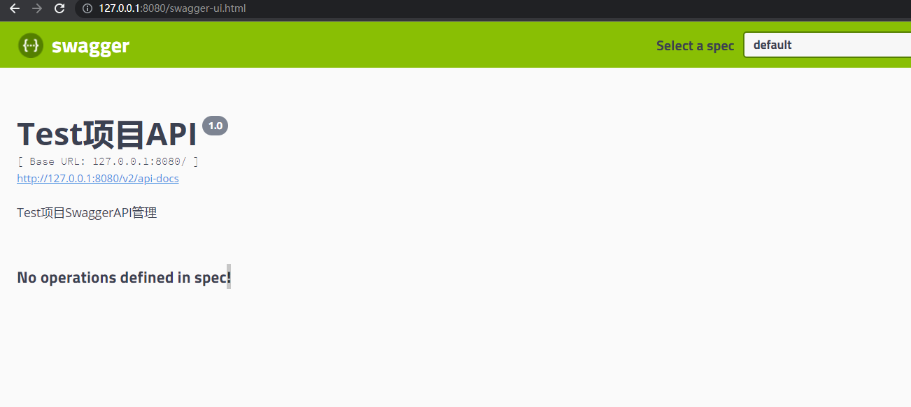

# 使用场景
## 定义接口组

接口有时候应该是分组的，而且大部分都是在一个 controller 中的，比如用户管理相关的接口应该都在 UserController 中，那么不同的业务的时候，应该定义/划分不同的接口组。接口组可以使用 `@Api` 来划分。
比如：

```java
@Api(tags = "角色管理") //可以当作是这个组的名字。
@RestController
public class RoleController {
}
```

和

```java
@Api(tags = "用户管理") //可以当作是这个组的名字。
@RestController
public class UserController {
}
```

- 你也可以理解成基于tags来分组，就好像一些文章里面的标签一样，使用标签来分类。
- 如果这个Controller下（接口组）下面没有接口，那么在swagger ui中是不会显示的，如果有的话就会这样显示：

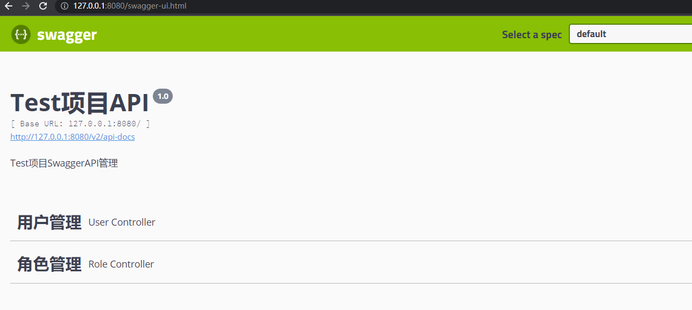

## 定义接口

使用了@Api来标注一个Controller之后，如果下面有接口，那么就会默认生成文档，但没有我们自定义的说明：

```java
@Api(tags = "用户管理")
@RestController
public class UserController {
    // 注意，对于swagger，不要使用@RequestMapping，
    // 因为@RequestMapping支持任意请求方式，swagger会为这个接口生成7种请求方式的接口文档
    @GetMapping("/info") 
    public String info(String id){
        return "aaa";
    }
}
```

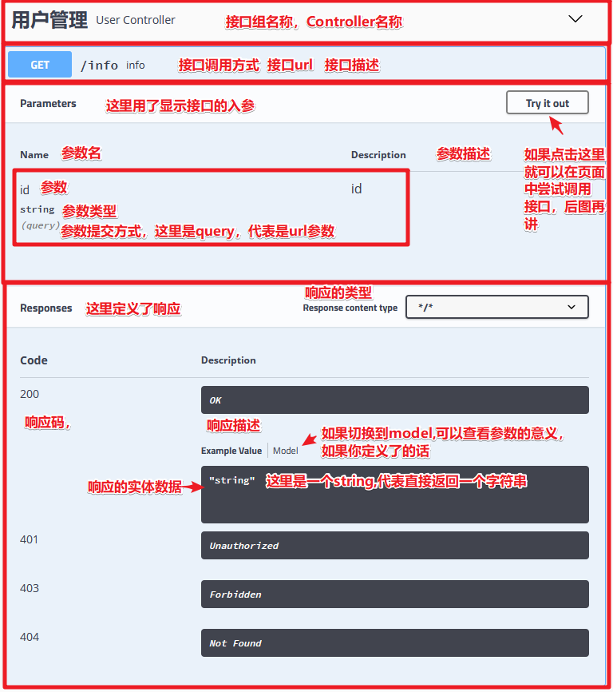
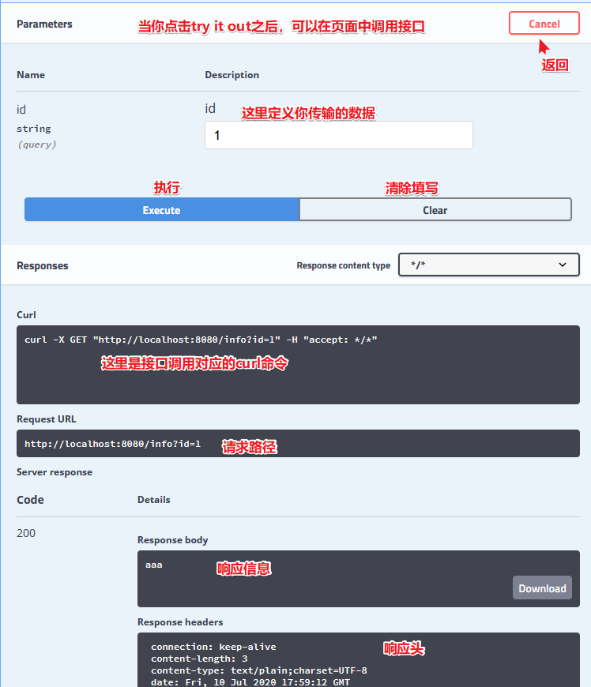

可以使用`@ApiOperation`来描述接口，比如：

```java
    @ApiOperation(value = "用户测试",notes = "用户测试notes")
    @GetMapping("/test")
    public String test(String id){
        return "test";
    }
```

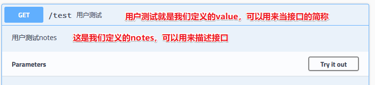

常用配置项：

- value：可以当作是接口的简称
- notes：接口的描述
- tags：可以额外定义接口组，比如这个接口外层已经有 `@Api(tags = "用户管理")` ，将接口划分到了“用户管理”中，但你可以额外的使用tags，例如 `tags = "角色管理"` 让角色管理中也有这个接口文档。

## 定义接口请求参数
上面使用了`@ApiOperation`来了描述接口，但其实还缺少接口请求参数的说明，下面分场景来讲。

- 注意一下，**对于GET方式，swagger不推荐使用body方式来传递数据**，也就是不希望在GET方式时使用json、form-data等方式来传递，这时候最好使用路径参数或者url参数。(😓虽然POSTMAN等是支持的)，所以如果接口传递的数据是json或者form-data方式的，还是使用POST方式好。

### 场景一：请求参数是实体类
此时我们需要使用`@ApiModel`来标注实体类，然后在接口中定义入参为实体类即可：

@ApiModel：用来标类
- 常用配置项：
  - value：实体类简称
  - description：实体类说明

@ApiModelProperty：用来描述类的字段的意义。
- 常用配置项：
  - value：字段说明
  - example：设置请求示例（Example Value）的默认值，如果不配置，当字段为string的时候，此时请求示例中默认值为"".
  - name：用新的字段名来替代旧的字段名。
  - allowableValues：限制值得范围，例如`{1,2,3}`代表只能取这三个值；`[1,5]`代表取1到5的值；`(1,5)`代表1到5的值，不包括1和5；还可以使用infinity或-infinity来无限值，比如`[1, infinity]`代表最小值为1，最大值无穷大。
  - required：标记字段是否必填，默认是false,
  - hidden：用来隐藏字段，默认是false，如果要隐藏需要使用true，因为字段默认都会显示，就算没有`@ApiModelProperty`。

```java
// 先使用@ApiModel来标注类
@ApiModel(value="用户登录表单对象",description="用户登录表单对象")
public class LoginForm {
    // 使用ApiModelProperty来标注字段属性。
    @ApiModelProperty(value = "用户名",required = true,example = "root")
    private String username;
    @ApiModelProperty(value = "密码",required = true,example = "123456")
    private String password;

    // 此处省略入参赋值时需要的getter,setter,swagger也需要这个
}
```

定义成入参：

```java
    @ApiOperation(value = "登录接口",notes = "登录接口的说明")
    @PostMapping("/login")
    public LoginForm login(@RequestBody LoginForm loginForm){
        return loginForm;
    }
```

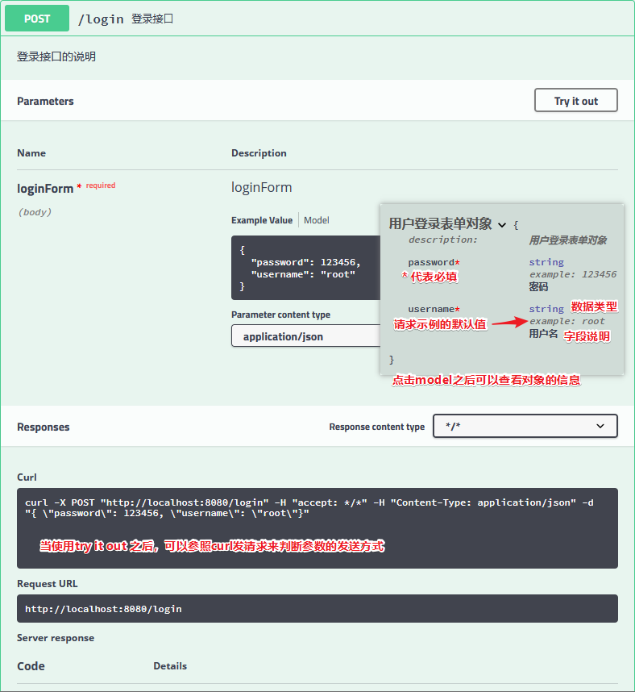

### 场景二：请求参数是非实体类
（再说一次：对于GET方式，swagger不推荐使用body方式来传递数据，所以虽然Spring MVC可以自动封装参数，但对于GET请求还是不要使用form-data，json等方式传递参数，除非你使用Postman来测试接口，swagger在线测试是不支持这个操作的）

对于非实体类参数，可以使用`@ApiImplicitParams`和`@ApiImplicitParam`来声明请求参数。
`@ApiImplicitParams`用在方法头上，`@ApiImplicitParam`定义在`@ApiImplicitParams`里面，一个`@ApiImplicitParam`对应一个参数。

`@ApiImplicitParam`常用配置项:

- name：用来定义参数的名字，也就是字段的名字,可以与接口的入参名对应。如果不对应，也会生成，所以可以用来定义额外参数！
- value：用来描述参数
- required：用来标注参数是否必填
- paramType有path,query,body,form,header等方式，但对于对于非实体类参数的时候，常用的只有path,query,header；body和form是不常用的。body不适用于多个零散参数的情况，只适用于json对象等情况。(如果接口是`form-data`,`x-www-form-urlencoded`的时候可能不能使用swagger页面API调试，但可以在后面讲到基于BootstrapUI的swagger增强中调试，基于BootstrapUI的swagger支持指定`form-data`或`x-www-form-urlencoded`)

示例一：声明入参是URL参数

```java
  // 使用URL query参数
    @ApiOperation(value = "登录接口2",notes = "登录接口的说明2")
    @ApiImplicitParams({
            @ApiImplicitParam(name = "username",//参数名字
                    value = "用户名",//参数的描述
                    required = true,//是否必须传入
                    //paramType定义参数传递类型：有path,query,body,form,header
                    paramType = "query"
                    )
            ,
            @ApiImplicitParam(name = "password",//参数名字
                    value = "密码",//参数的描述
                    required = true,//是否必须传入
                    paramType = "query"
                    )
    })
    @PostMapping(value = "/login2")
    public LoginForm login2(String username,String password){
        System.out.println(username+":"+password);
        LoginForm loginForm = new LoginForm();
        loginForm.setUsername(username);
        loginForm.setPassword(password);
        return loginForm;
    }
```

示例二：声明入参是URL路径参数

```java
    // 使用路径参数
    @PostMapping("/login3/{id1}/{id2}")
    @ApiOperation(value = "登录接口3",notes = "登录接口的说明3")
    @ApiImplicitParams({
            @ApiImplicitParam(name = "id1",//参数名字
                    value = "用户名",//参数的描述
                    required = true,//是否必须传入
                    //paramType定义参数传递类型：有path,query,body,form,header
                    paramType = "path"
            )
            ,
            @ApiImplicitParam(name = "id2",//参数名字
                    value = "密码",//参数的描述
                    required = true,//是否必须传入
                    paramType = "path"
            )
    })
    public String login3(@PathVariable Integer id1,@PathVariable Integer id2){
        return id1+":"+id2;
    }
```

示例三：声明入参是header参数

```java
    // 用header传递参数
    @PostMapping("/login4")
    @ApiOperation(value = "登录接口4",notes = "登录接口的说明4")
    @ApiImplicitParams({
            @ApiImplicitParam(name = "username",//参数名字
                    value = "用户名",//参数的描述
                    required = true,//是否必须传入
                    //paramType定义参数传递类型：有path,query,body,form,header
                    paramType = "header"
            )
            ,
            @ApiImplicitParam(name = "password",//参数名字
                    value = "密码",//参数的描述
                    required = true,//是否必须传入
                    paramType = "header"
            )
    })
    public String login4( @RequestHeader String username,
                          @RequestHeader String password){
        return username+":"+password;
    }
```

示例四：声明文件上传参数

```java
    // 有文件上传时要用@ApiParam，用法基本与@ApiImplicitParam一样，不过@ApiParam用在参数上
    // 或者你也可以不注解，swagger会自动生成说明
    @ApiOperation(value = "上传文件",notes = "上传文件")
    @PostMapping(value = "/upload")
    public String upload(@ApiParam(value = "图片文件", required = true)MultipartFile uploadFile){
        String originalFilename = uploadFile.getOriginalFilename();

        return originalFilename;
    }
    

    // 多个文件上传时，**swagger只能测试单文件上传**
    @ApiOperation(value = "上传多个文件",notes = "上传多个文件")
    @PostMapping(value = "/upload2",consumes = "multipart/*", headers = "content-type=multipart/form-data")
    public String upload2(@ApiParam(value = "图片文件", required = true,allowMultiple = true)MultipartFile[] uploadFile){
        StringBuffer sb = new StringBuffer();
        for (int i = 0; i < uploadFile.length; i++) {
            System.out.println(uploadFile[i].getOriginalFilename());
            sb.append(uploadFile[i].getOriginalFilename());
            sb.append(",");
        }
        return sb.toString();
    }


    // 既有文件，又有参数
    @ApiOperation(value = "既有文件，又有参数",notes = "既有文件，又有参数")
    @PostMapping(value = "/upload3")
    @ApiImplicitParams({
            @ApiImplicitParam(name = "name",
                    value = "图片新名字",
                    required = true
            )
    })
    public String upload3(@ApiParam(value = "图片文件", required = true)MultipartFile uploadFile,
                          String name){
        String originalFilename = uploadFile.getOriginalFilename();

        return originalFilename+":"+name;
    }
```

## 定义接口响应
定义接口响应，是方便查看接口文档的人能够知道接口返回的数据的意义。

### 响应是实体类
前面在定义接口请求参数的时候有提到使用`@ApiModel`来标注类，如果接口返回了这个类，那么这个类上的说明也会作为响应的说明：

```java
   // 返回被@ApiModel标注的类对象
    @ApiOperation(value = "实体类响应",notes = "返回数据为实体类的接口")
    @PostMapping("/role1")
    public LoginForm role1(@RequestBody LoginForm loginForm){
        return loginForm;
    }
```

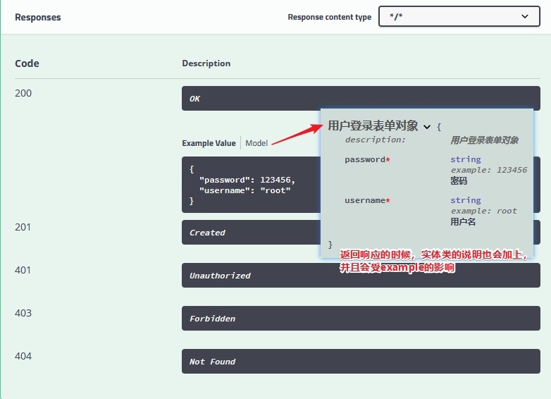

### 响应是非实体类
swagger无法对非实体类的响应进行详细说明，只能标注响应码等信息。是通过`@ApiResponses`和`@ApiResponse`来实现的。

`@ApiResponses`和`@ApiResponse`可以与`@ApiModel`一起使用。

```java
  // 其他类型的,此时不能增加字段注释，所以其实swagger推荐使用实体类
    @ApiOperation(value = "非实体类",notes = "非实体类")
    @ApiResponses({
            @ApiResponse(code=200,message = "调用成功"),
            @ApiResponse(code=401,message = "无权限" )
    }
    )
    @PostMapping("/role2")
    public String role2(){
        return " {\n" +
                " name:\"广东\",\n" +
                "     citys:{\n" +
                "         city:[\"广州\",\"深圳\",\"珠海\"]\n" +
                "     }\n" +
                " }";
    }
```

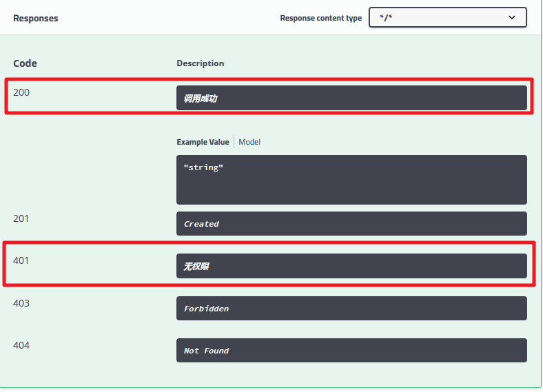

# Swagger UI增强
有一些第三方提供了一些Swagger UI增强，比较流行的是`swagger-bootstrap-ui`，我们这里以`swagger-bootstrap-ui`为例。

对比:

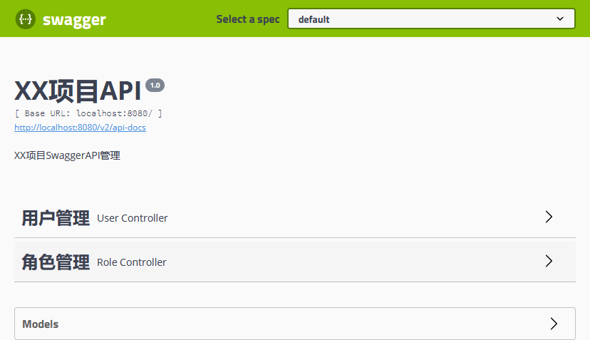
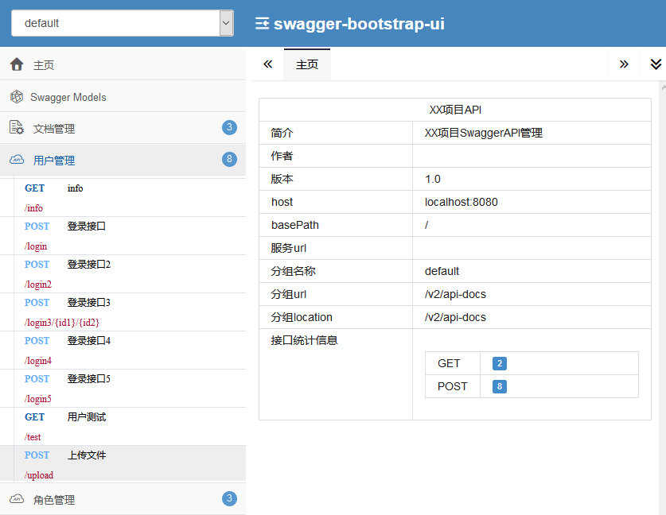

## 使用
添加依赖

```xml
        <!--引入swagger-->
        <dependency>
            <groupId>io.springfox</groupId>
            <artifactId>springfox-swagger2</artifactId>
            <version>2.9.2</version>
        </dependency>
        <dependency>
            <groupId>io.springfox</groupId>
            <artifactId>springfox-swagger-ui</artifactId>
            <version>2.9.2</version>
        </dependency>
        <!-- 引入swagger-bootstrap-ui依赖包-->
        <dependency>
            <groupId>com.github.xiaoymin</groupId>
            <artifactId>swagger-bootstrap-ui</artifactId>
            <version>1.8.7</version>
        </dependency>
```

在swagger配置类中增加注解`@EnableSwaggerBootstrapUI`:

```java
@Configuration // 标明是配置类
@EnableSwagger2 //开启swagger功能
@EnableSwaggerBootstrapUI // 开启SwaggerBootstrapUI
public class SwaggerConfig {
    // 省略配置内容
}
```

访问API：http://localhost:8080/doc.html，即可预览到基于bootstarp的Swagger UI界面。

## 优点
- 基于BootstrapUI的swagger支持指定form-data或x-www-form-urlencoded

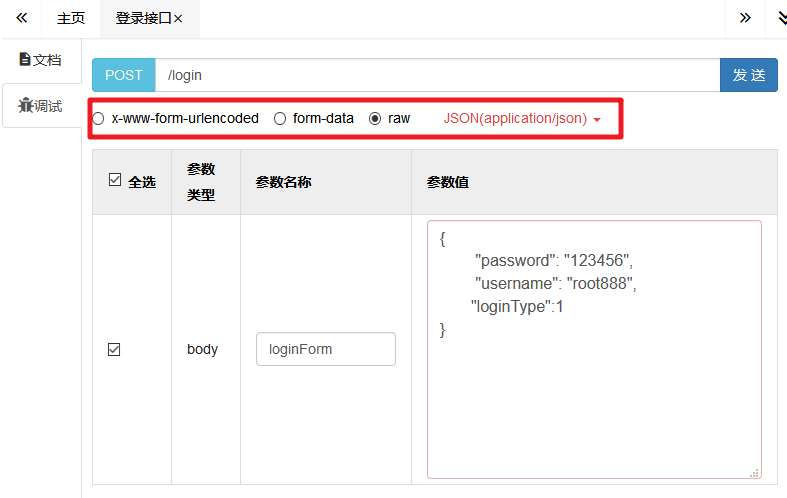

- 支持复制单个API文档和导出全部API文档


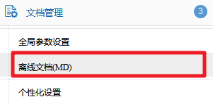

# 整合Spring Security注意
在Spring Boot整合Spring Security和Swagger的时候，需要配置拦截的路径和放行的路径，注意是放行以下几个路径。

```java
.antMatchers("/swagger**/**").permitAll()
.antMatchers("/webjars/**").permitAll()
.antMatchers("/v2/**").permitAll()
.antMatchers("/doc.html").permitAll() // 如果你用了bootstarp的Swagger UI界面，加一个这个。
```

# 对于token的处理
在swagger中只支持了简单的调试，但对于一些接口，我们测试的时候可能需要把token信息写到header中，目前好像没看到可以自定义加请求头的地方

方法一：
　　如果使用了Swagger BootstrapUI，那么你可以在“文档管理”中增加全局参数，这包括了添加header参数。

方法二：在swagger配置类中增加全局参数配置：

```java
    //如果有额外的全局参数，比如说请求头参数，可以这样添加
        ParameterBuilder parameterBuilder = new ParameterBuilder();
        List<Parameter> parameters = new ArrayList<Parameter>();
        parameterBuilder.name("authorization").description("令牌")
                .modelRef(new ModelRef("string")).parameterType("header").required(false).build();
        parameters.add(parameterBuilder.build());
        return new Docket(DocumentationType.SWAGGER_2)  // DocumentationType.SWAGGER_2 固定的，代表swagger2
                .apiInfo(apiInfo()) // 用于生成API信息
                .select() // select()函数返回一个ApiSelectorBuilder实例,用来控制接口被swagger做成文档
                .apis(RequestHandlerSelectors.basePackage("com.example.controller")) // 用于指定扫描哪个包下的接口
                .paths(PathSelectors.any())// 选择所有的API,如果你想只为部分API生成文档，可以配置这里
                .build().globalOperationParameters(parameters);
```

方法三：使用`@ApiImplicitParams`来额外标注一个请求头参数，例如：

```java
 // 如果需要额外的参数，非本方法用到，但过滤器要用,类似于权限token
    @PostMapping("/login6")
    @ApiOperation(value = "带token的接口",notes = "带token的接口")
    @ApiImplicitParams({
            @ApiImplicitParam(name = "authorization",//参数名字
                    value = "授权token",//参数的描述
                    required = true,//是否必须传入
                    paramType = "header"
            )
            ,
            @ApiImplicitParam(name = "username",//参数名字
                    value = "用户名",//参数的描述
                    required = true,//是否必须传入
                    paramType = "query"
            )
    })
    public String login6(String username){
        return username;
    }
```
