# AES
https://blog.csdn.net/qq_28205153/article/details/55798628
https://www.jianshu.com/p/3840b344b27c

- 分组密码体制
- Padding(填充)
- IV(初始向量)
- Key(密钥)
- 加密模式
  - ECB：Electronic CodeBook mode（电子密码模式）
  - CBC：Cipher Block Chaining mode（密码分组链接模式）
  - CFB：Cipher FeedBack mode（密文反馈模式）
  - OFB：Output FeedBack mode（输出反馈模式）
  - CTR：CounTeR mode（计数器模式）

## 分组密码体制
所谓分组密码体制就是指将明文切成一段一段的来加密，然后再把一段一段的密文拼起来形成最终密文的加密方式。

AES采用分组密码体制，即AES加密会首先把明文切成一段一段的，而且每段数据的长度要求必须是128位16个字节，如果最后一段不够16个字节了，就需要用Padding来把这段数据填满16个字节，然后分别对每段数据进行加密，最后再把每段加密数据拼起来形成最终的密文，密钥长度可以是128位16个字节、192位或256位，通常采用需要初始向量IV的CBC模式，初始向量的长度也是128位16个字节。

## Padding
Padding就是用来把不满16个字节的分组数据填满16个字节用的，它有三种模式
- PKCS5
- PKCS7
- NOPADDING

解密端需要使用和加密端同样的Padding模式，才能准确的识别有效数据和填充数据。开发通常采用PKCS7 Padding模式。

### PKCS5
PKCS5是指分组数据缺少几个字节，就在数据的末尾填充几个字节的几，比如缺少5个字节，就在末尾填充5个字节的5。

### PKCS7
PKCS7是指分组数据缺少几个字节，就在数据的末尾填充几个字节的0，比如缺少7个字节，就在末尾填充7个字节的0。

### NOPADDING
NoPadding是指不需要填充，也就是说数据的发送方肯定会保证最后一段数据也正好是16个字节。

### 特殊情况
那如果在PKCS5模式下，最后一段数据的内容刚好就是16个16怎么办？那解密端就不知道这一段数据到底是有效数据还是填充数据了，因此对于这种情况，PKCS5模式会自动帮我们在最后一段数据后再添加16个字节的数据，而且填充数据也是16个16，这样解密段就能知道谁是有效数据谁是填充数据了。PKCS7最后一段数据的内容是16个0，也是同样的道理。

## IV
初始向量IV的作用是使加密更加安全可靠，我们使用AES加密时需要主动提供初始向量，而且只需要提供一个初始向量就够了，后面每段数据的加密向量都是前面一段的密文。初始向量IV的长度规定为128位16个字节，初始向量的来源为随机生成。

## Key
密钥：AES要求密钥的长度可以是128位16个字节、192位或者256位，位数越高，加密强度自然越大，但是加密的效率自然会低一些，因此要做好衡量。

开发通常采用128位16个字节的密钥，我们使用AES加密时需要主动提供密钥，而且只需要提供一个密钥就够了，每段数据加密使用的都是这一个密钥，密钥来源为随机生成。

## 加密模式
### ECB
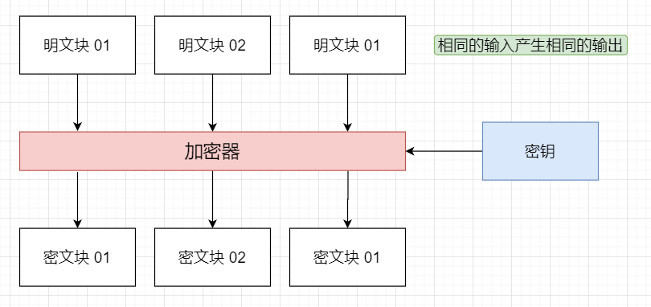
ECB模式是最基本的加密模式，即仅仅使用明文和密钥来加密数据，相同的明文块会被加密成相同的密文块，这样明文和密文的结构将是完全一样的，就会更容易被破解，相对来说不是那么安全，因此很少使用。

### CBC
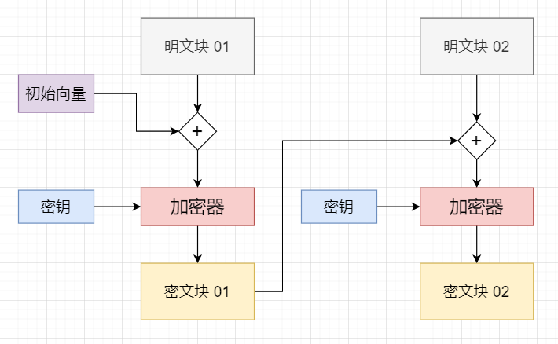
而CBC模式则比ECB模式多了一个初始向量IV，加密的时候，第一个明文块会首先和初始向量IV做异或操作，然后再经过密钥加密，然后第一个密文块又会作为第二个明文块的加密向量来异或，依次类推下去，这样相同的明文块加密出的密文块就是不同的，明文的结构和密文的结构也将是不同的，因此更加安全，我们常用的就是CBC加密模式。

## 加密流程
1. 首先AES加密会把明文按128位16个字节，切成一段一段的数据，如果数据的最后一段不够16个字节，会用Padding来填充。

2. 然后把明文块0与初始向量IV做异或操作，再用密钥加密，得到密文块0，同时密文块0也会被用作明文块1的加密向量。

3. 然后明文块1与密文块0进行异或操作，再用密钥加密，得到密文块1。（当然这里只是假设数据只有两段，如果数据不止两段，依次类推，就可以得到很多段密文块。）

4. 最后把密文块拼接起来就能得到最终的密文。

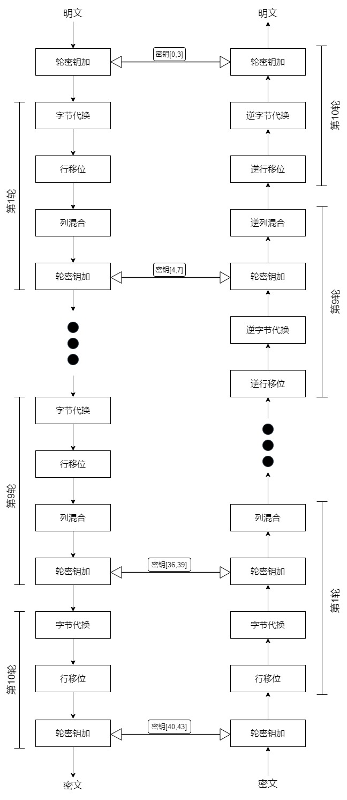

## 加密原理
AES   	|密钥长度（32位比特字)	|分组长度(32位比特字)	|加密轮数
-|-|-|-
AES-128	    |4	                  |4	                |10
AES-192	    |6	                  |4	                |12
AES-256	    |8	                  |4	                |14

>1位=1比特；1字=2字节；1字节=8位；1字=16位。
>1. 位
>
>位是计算机存储的最小单位，简记为b，也称为比特（bit）计算机中用二进制中的0和1>来表示数据，一个0或1就代表一位。位数通常指计算机中一次能处理的数据大小；
>
>1. 比特
>
>比特（bit）是由英文BIT音译而来，比特同时也是二进制数字中的位，是信息量的度量>单位，为信息量的最小单位；
>
>3. 字节
>
>字节，英文Byte，是计算机用于计量存储容量的一种计量单位，通常情况下一字节等于>八位，字节同时也在一些计算机编程语言中表示数据类型和语言字符，在现代计算机中，>一个字节等于八位；
>
>4. 字
>
>字是表示计算机自然数据单位的术语，在某个特定计算机中，字是其用来一次性处理事务>的一个固定长度的位（bit）组，在现代计算机中，一个字等于两个字节。

- 密钥扩展
- 初始轮
- 重复轮
- 最终轮

以下以AES-128为例子

### 密钥扩展
AES首先将初始密钥输入到一个44的状态矩阵中，如下图所示。

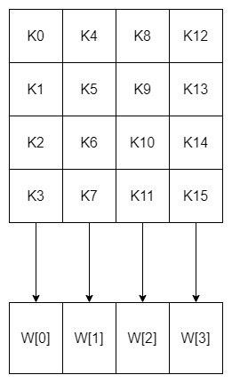

这个44矩阵的每一列的4个字节组成一个字，矩阵4列的4个字依次命名为W[0]、W[1]、W[2]和W[3]，它们构成一个以字为单位的数组W。

例如，设密钥K为"abcdefghijklmnop",则K0 = ‘a’,K1 = ‘b’, K2 = ‘c’,K3 = ‘d’,W[0] = “abcd”。

接着，对W数组扩充40个新列，构成总共44列的扩展密钥数组。新列以如下的递归方式产生：

1. 如果i不是4的倍数，那么第i列由如下等式确定：
- W[i]=W[i-4]⨁W[i-1]
2. 如果i是4的倍数，那么第i列由如下等式确定：
- W[i]=W[i-4]⨁T(W[i-1])

其中，T是一个有点复杂的函数。

函数T由3部分组成：字循环、字节代换和轮常量异或，这3部分的作用分别如下。

- 字循环：将1个字中的4个字节循环左移1个字节。即将输入字[b0, b1, b2, b3]变换成[b1,b2,b3,b0]。
- 字节代换：对字循环的结果使用S盒进行字节代换。
- 轮常量异或：将前两步的结果同轮常量Rcon[j]进行异或，其中j表示轮数。

轮常量Rcon[j]是一个字，其值见下表。

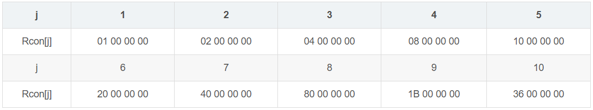

下面举个例子

设初始的128位密钥为：

```
3C A1 0B 21 57 F0 19 16 90 2E 13 80 AC C1 07 BD
```

那么4个初始值为：

```
W[0] = 3C A1 0B 21
W[1] = 57 F0 19 16
W[2] = 90 2E 13 80
W[3] = AC C1 07 BD
```

下面求扩展的第1轮的子密钥(W[4],W[5],W[6],W[7])。
由于4是4的倍数，所以：
W[4] = W[0] ⨁ T(W[3])

T(W[3])的计算步骤如下：

循环地将W[3]的元素移位：AC C1 07 BD变成C1 07 BD AC;

将 C1 07 BD AC 作为S盒的输入，输出为78 C5 7A 91;

将78 C5 7A 91与第一轮轮常量Rcon[1]进行异或运算，将得到79 C5 7A 91，因此，T(W[3])=79 C5 7A 91，故
W[4] = 3C A1 0B 21 ⨁ 79 C5 7A 91 = 45 64 71 B0

其余的3个子密钥段的计算如下：

```
W[5] = W[1] ⨁ W[4] = 57 F0 19 16 ⨁ 45 64 71 B0 = 12 94 68 A6
W[6] = W[2] ⨁ W[5] =90 2E 13 80 ⨁ 12 94 68 A6 = 82 BA 7B 26
W[7] = W[3] ⨁ W[6] = AC C1 07 BD ⨁ 82 BA 7B 26 = 2E 7B 7C 9B
```

所以，第一轮的密钥为 45 64 71 B0 12 94 68 A6 82 BA 7B 26 2E 7B 7C 9B。

### 初始轮(额外的一轮)
初始轮就是将128位的明文数据与128位的初始密钥进行异或操作。

### 重复轮(9轮)
- 字节混淆(字节代换)
- 行移位
- 列混乱(列混合)
- 加轮密钥

#### 字节混淆(字节代换)
AES的字节代换其实就是一个简单的查表操作。AES定义了一个S盒和一个逆S盒。

- S盒
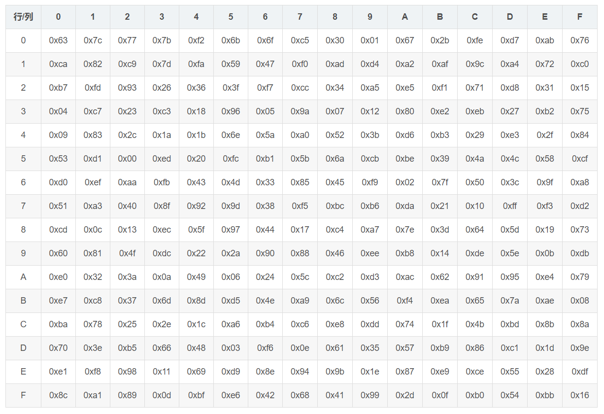

状态矩阵中的元素按照下面的方式映射为一个新的字节：把该字节的高4位作为行值，低4位作为列值，取出S盒或者逆S盒中对应的行的元素作为输出。

例如，加密时，输出的字节S1为0x11,则查S盒的第0x01行和0x01列，得到值0x82,然后替换S1原有的0x11为0x82。

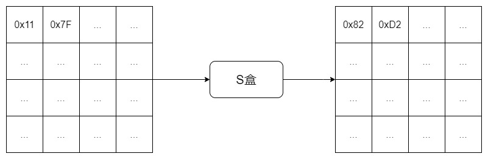

- 逆S盒


#### 行移位
1. 行移位

行移位是一个简单的左循环移位操作。当密钥长度为128比特时，状态矩阵的第0行左移0字节，第1行左移1字节，第2行左移2字节，第3行左移3字节，如下图所示：

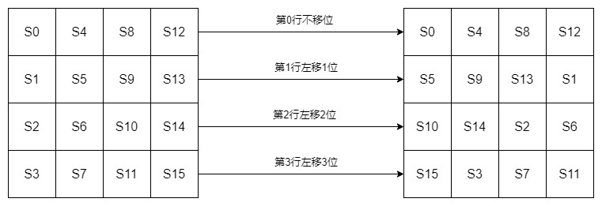

2. 行移位的逆变换

行移位的逆变换是将状态矩阵中的每一行执行相反的移位操作，例如AES-128中，状态矩阵的第0行右移0字节，第1行右移1字节，第2行右移2字节，第3行右移3字节。

#### 列混乱(列混合)

1. 列混合

列混合变换是通过矩阵相乘来实现的，经行移位后的状态矩阵与固定的矩阵相乘，得到混淆后的状态矩阵，如下图的公式所示：

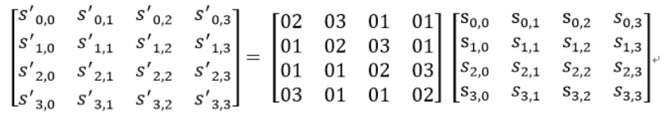

状态矩阵中的第j列(0 ≤j≤3)的列混合可以表示为下图所示：

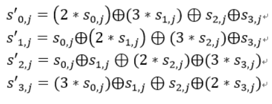

下面举个具体的例子,输入的状态矩阵如下：

```
C9	E5	FD	2B
7A	F2	78	6E
63	9C	26	67
B0	A7	82	E5
```
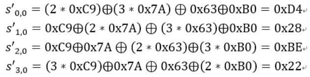

其它列的计算就不列举了，列混合后生成的新状态矩阵如下：

```
D4	E7	CD	66
28	02	E5	BB
BE	C6	D6	BF
22	0F	DF	A5
```

2. 列混合逆运算

逆向列混合变换可由下图的矩阵乘法定义：

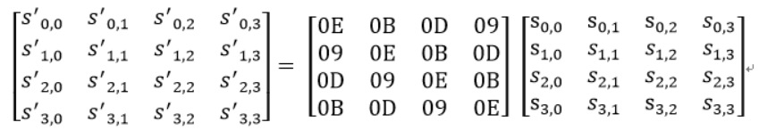

可以验证，逆变换矩阵同正变换矩阵的乘积恰好为单位矩阵。

#### 轮密钥加
轮密钥加是将128位轮密钥Ki同状态矩阵中的数据进行逐位异或操作，如下图所示。

其中，密钥Ki中每个字W[4i],W[4i+1],W[4i+2],W[4i+3]为32位比特字，包含4个字节，他们的生成算法下面在下面介绍。轮密钥加过程可以看成是字逐位异或的结果，也可以看成字节级别或者位级别的操作。也就是说，可以看成S0 S1 S2 S3 组成的32位字与W[4i]的异或运算。

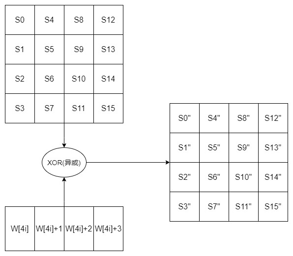

轮密钥加的逆运算同正向的轮密钥加运算完全一致，这是因为异或的逆操作是其自身。轮密钥加非常简单，但却能够影响S数组中的每一位。

### 最终轮(最后1轮)
最后一轮迭代不执行列混合